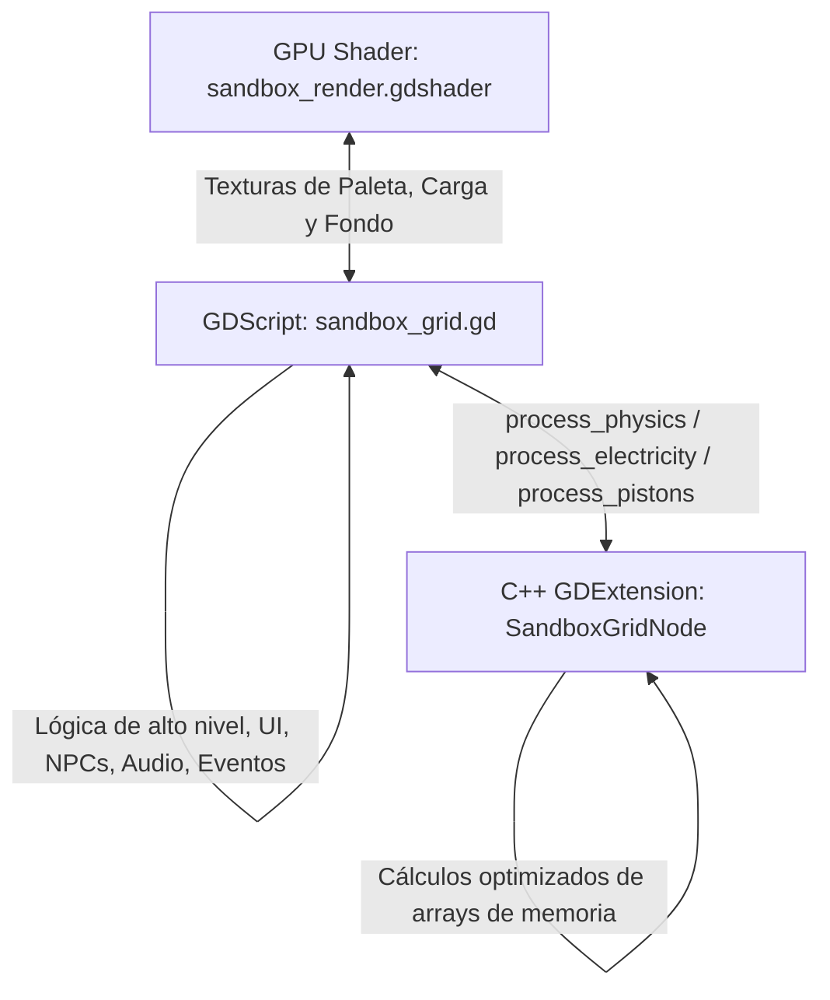

# Manual de Arquitectura y Contexto Técnico: Sandbox Game
> **Propósito del Documento**: Este archivo sirve como la **fuente de verdad y contexto integral** tanto para desarrolladores como para modelos de inteligencia artificial (LLMs). Permite entender, localizar, modificar y extender cualquier subsistema del proyecto de forma rápida y segura, sin depender de números de línea estáticos que cambian con cada edición.

---

## 1. Visión General del Proyecto

### 1.1 Naturaleza del Proyecto
**Sandbox Game** es un simulador de física de partículas / autómata celular interactivo ("falling-sand game") en 2D desarrollado para dispositivos móviles y PC sobre **Godot Engine (versión 4.x)**. Permite al usuario interactuar con materiales elementales, fluidos, gases, circuitos lógicos, mecanismos de pistones y cañones, desastres naturales, bloques musicales y personajes inteligentes (NPCs) con emociones y personalidades dinámicas.

### 1.2 Arquitectura Híbrida (C++ GDExtension + GDScript + GL Shaders)
Debido a la alta exigencia computacional de simular hasta cientos de miles de celdas por segundo en dispositivos móviles, el juego implementa una arquitectura en tres capas:



1. **Capa C++ (GDExtension - `SandboxGridNode`)**:
   - Código fuente en `sandbox/gdextension/src/` (`sandbox_grid_node.cpp`, `sandbox_grid_node.h`).
   - Procesa la física pesada de partículas (`process_physics`), la propagación rápida de electricidad (`process_electricity`), el cálculo de empuje de pistones (`process_pistons`) y el mapeo acelerado de datos de guardado (`map_grid_data`).
2. **Capa GDScript (Controlador Monolítico - `SandboxGrid`)**:
   - Archivo: `sandbox/scripts/sandbox/sandbox_grid.gd` (clase `SandboxGrid` que hereda de `SandboxGridNode`).
   - Centraliza la orquestación general: interfaz de usuario (HUD), eventos táctiles/ratón, inteligencia artificial de NPCs, sistema de sonido, logros, taller en línea (Workshop), laboratorio de alquimia y guardado/carga.
3. **Capa GPU (Fragment Shader - `sandbox_render.gdshader`)**:
   - Convierte los IDs lógicos de material y cargas eléctricas en gráficos coloreados con texturas procedurales a través de una paleta de 2048x3 píxeles (`palette_tex`), una textura de carga (`charge_tex`) y capas de pintura (`background_tex`, `element_color_tex`).

### 1.3 Estructura del Árbol de Directorios
- `sandbox/`: Raíz del proyecto de Godot.
  - `project.godot`: Configuración principal del motor, autoloads, ventana y extensiones.
  - `gdextension/`: Código fuente en C++ y scripts de compilación SCons para Windows y Android.
  - `scenes/`:
    - `main/loading_screen.tscn`: Escena de arranque del juego.
    - `main/main_scene.tscn`: Escena principal donde se aloja el nodo de la cuadrícula y el HUD.
    - `main/world_card.tscn`: Tarjeta UI para previsualizar mundos del Workshop.
    - `npc_editor.tscn`: Escena del editor visual de píxeles para NPCs personalizados.
  - `scripts/`:
    - `sandbox/sandbox_grid.gd`: **Controlador central monolítico**.
    - `sandbox/material.gd`: Recurso `SandboxMaterial` y definición canónica de `Tags`.
    - `sandbox/npc_editor.gd`: Lógica del editor de sprites/estados de NPCs (20x20 píxeles).
    - `sandbox/workshop_manager.gd`: Gestor de red, Firebase y subida/descarga de mundos.
    - `sandbox/world_card.gd`: Lógica de interacción con tarjetas de mundos (Likes, reportes, descargas).
    - `sandbox/sandbox_render.gdshader`: Shader principal de dibujado de la cuadrícula.
    - `sandbox/tornado_visual.gdshader`: Shader de distorsión visual para el vórtice del tornado.
    - `admob_manager.gd`: Autoload para banners, anuncios intersticiales y recompensados (AdMob).
    - `version_manager.gd`: Autoload de verificación de versión remota vía JSON en GitHub.
    - `analytics_manager.gd`: Autoload para registro de eventos en Firebase Analytics.
    - `notification_manager.gd`: Autoload para notificaciones push locales en móviles.
  - `assets/`: Texturas, iconos de logros (`icon_ach/`), fuentes seguras y audio SFX (`audio/sfx/`).
  - `translations/`: Tablas de traducción CSV y archivos `.translation` (ES, EN, IT, FR, DE, PT).

### 1.4 Singletons y Autoloads (`project.godot`)
- `VersionManager`: Comprueba actualizaciones requeridas o sugeridas consultando `version_config.json`.
- `AdMobManager`: Gestiona ciclos de vida de anuncios, política de privacidad GDPR/UMP y señales de desbloqueo.
- `AnalyticsManager`: Envía eventos telemétricos a Firebase.
- `NotificationScheduler` y `NotificationManager`: Planifican recordatorios locales para el jugador.
- `GodotPlayGameServices`: Integra inicio de sesión y sincronización de logros con Google Play Games.
- `WorkshopManager`: Conecta el cliente con Firebase Firestore/Storage y la autenticación del usuario.
- `Firebase`: Plugin base para REST API de Firebase.

---

## 2. Convenciones para Navegar `sandbox_grid.gd`

> [!WARNING]
> **REGLA FUNDAMENTAL: NUNCA USAR NÚMEROS DE LÍNEA ABSOLUTOS**  
> `sandbox_grid.gd` cuenta con más de 21.800 líneas de código en continuo desarrollo. Cualquier número de línea quedará desactualizado con futuras modificaciones.  
> Para ubicar o referenciar código, utilice **siempre**:
> 1. El **nombre exacto de la función** (ej. `_setup_main_ui_containers`, `_process_npcs`, `_step_simulation`).
> 2. Las **constantes o variables clave** (ej. `NPC_PROFILES`, `GOOGLE_PLAY_ACHIEVEMENTS`, `lab_custom_data`).
> 3. La **sección lógica relativa** guiada por los comentarios bandera (ej. `# --- RAW MATERIALS ---`, `# --- MUSIC SYSTEM ---`, `# --- SFX SYSTEM ---`).

### Mapa de Ubicación Relativa de Funciones en `sandbox_grid.gd`

| Sección Lógica | Banderas de Búsqueda en el Código | Funciones y Variables Clave |
| :--- | :--- | :--- |
| **Cabecera y Búferes** | `# Simulation Data`, `# Simulation Chunking`, `# GPU Rendering Data` | `cells`, `tags_array`, `charge_array`, `CHUNK_SIZE`, `grid_scale`, `MAX_PIXELS_PER_FRAME` |
| **Cámara y Zoom** | `# --- SIMULATION CAMERA ---` | `_zoom_camera`, `_set_panning_mode`, `_clamp_camera_position`, `_update_zoom_ui` |
| **Constantes de Datos** | `# --- MUSIC SYSTEM ---`, `NPC_PROFILES`, `NPC_VISUALS` | `MUSIC_INSTRUMENTS`, `NPC_PROFILES`, `NPC_VISUALS`, `SPATIAL_CELL_SIZE`, `SFX_POOL_SIZE` |
| **Ciclo de Vida** | `func _ready()`, `# --- ORIENTATION INITIALIZATION ---` | `_ready()`, `_save_tool_settings()`, `_load_tool_settings()`, `_on_window_resized()` |
| **Registro de Materiales** | `# --- RAW MATERIALS (0-20) ---`, `# --- LOGIC GATES ---`, `# --- BIOLOGICALS ---` | `_register_material()`, `material_tags_raw`, `mat_colors_1`, `mat_colors_2`, `mat_colors_3` |
| **Tutoriales y Ayuda** | `# --- MAIN TUTORIAL ---`, `_start_interactive_tutorial` | `_show_main_tutorial_step()`, `_show_unified_tutorial_bubble()`, `_start_pulse()` |
| **Logros (Achievements)** | `# --- ACHIEVEMENT SYSTEM DATA ---`, `# --- ACHIEVEMENT POLLING SEQUENCE ---` | `GOOGLE_PLAY_ACHIEVEMENTS`, `_check_achievement_conditions()`, `_check_achievement_step()`, `_unlock_achievement()` |
| **Construcción del HUD** | `func _setup_main_ui_containers()`, `# --- QUICK ACTIONS GRID ---` | `_setup_main_ui_containers()`, `_create_vertical_category_btn()`, `_align_panel_to_hud()`, `action_hbox`, `action_vbox`, `material_grid` |
| **Panel de Herramientas** | `func _setup_tools_ui()` | `_setup_tools_ui()`, `_on_tools_btn_pressed()`, `_update_game_volume()`, fila de pincel, idiomas, pausa y reinicio |
| **Panel de Workshop** | `func _setup_workshop_ui()`, `# --- WORKSHOP UI ---` | `_fetch_top_async()`, `_fetch_recientes_async()`, `_on_world_download_requested()`, `_show_upload_world_dialog()` |
| **Panel de Laboratorio** | `func _setup_lab_ui()`, `_apply_custom_material_to_engine` | `_apply_custom_material_to_engine()`, `_update_lab_inspector()`, `_sync_palette_to_shader()`, `_save_lab_state()`, `_load_lab_state()` |
| **Panel de Desastres** | `func _setup_disaster_ui()` | `_setup_disaster_ui()`, `_reset_all_disasters()`, botones de volcán, tornado, terremoto, tsunami, bombardero |
| **Sistema de Audio (SFX)** | `# --- SFX SYSTEM ---`, `# --- AUDIO POOL INITIALIZATION ---` | `_play_sfx()`, `_play_action_sound()`, `_play_material_sound()`, `_manage_looping_player()`, `_get_sfx_stream()` |
| **Bucle Principal del Frame** | `func _process(delta)`, `func _draw()` | `_process()`, `_draw()`, interacción con el ratón, trazado de trazos, actualización de temporizadores de desastres |
| **Historial (Undo/Redo)** | `# --- HISTORY SYSTEM ---` | `save_history_state()`, `undo_history()`, `redo_history()`, `_deep_copy_npcs()`, `_deep_copy_logic_gates()` |
| **Lógica de Desastres** | `_process_tsunami`, `_process_tornado`, `_process_earthquake` | `_process_tsunami()`, `_process_tornado()`, `_process_earthquake()`, `_process_bombardero()`, `_process_weather()`, `_strike_lightning()` |
| **Pintura y Dibujo** | `func _draw_circle`, `func _paint_background_circle` | `_draw_circle()`, `_paint_background_circle()`, `_paint_elements_circle()`, `_set_cell()`, `_get_cell()` |
| **Simulación Celular (Step)** | `func _step_simulation()` | `_step_simulation()`, `_move_particle()`, `_swap_cells()`, `_process_interactions()`, `_process_electricity()` |
| **Pintura UI** | `func _setup_paint_ui()` | `_setup_paint_ui()`, `_add_recent_paint_color()`, selectores de color |
| **NPCs: Lógica e IA** | `func _process_npcs(delta)`, `NPC_PROFILES` | `_process_npcs()`, `_place_npc()`, `_attack_npc()`, `_check_npc_environment_damage()`, `_set_npc_emoji()`, `_find_closest_enemy()` |
| **NPCs: Control Manual** | `func _setup_npc_control_gui()` | `_setup_npc_control_gui()`, `_handle_controlled_npc_input()`, `_trigger_controlled_npc_action()`, `_stop_controlling_npc()` |
| **Explosiones** | `func _explode(...)` | `_explode()`, `_prime_explosive()`, `_trigger_electric_devices()` |
| **Circuitos y Compuertas** | `func _simulate_logic_gates()` | `_simulate_logic_gates()`, `_draw_logic_gate_shape()`, `_place_circuit_block()`, `_load_active_logic_gates()` |
| **Pistones** | `func _simulate_pistons()` | `_place_piston()`, `_simulate_pistons()`, `_get_piston_head_pixels()`, `_get_piston_base_pixels()` |
| **Cañones y Tuberías** | `func _simulate_cannons()`, `func _simulate_pipes()` | `_place_cannon()`, `_place_pipe()`, `_place_pipe_x2()`, `_fire_cannon()`, `_simulate_cannons()`, `_simulate_pipes()`, `_eject_npc_from_pipe()` |
| **Sistema Musical** | `# --- MUSIC SYSTEM IMPLEMENTATION ---` | `_register_musical_materials()`, `_place_music_block()`, `_play_music_note()`, `_setup_music_ui()` |
| **Guardado / Carga Local** | `# --- SAVE / LOAD SYSTEM ---` | `_setup_save_ui()`, `_save_to_slot()`, `_load_from_slot()`, `_import_sbu_file()`, `_on_share_pressed()` |
| **Menú de Logros UI** | `func _setup_achievement_menu()` | `_setup_achievement_menu()`, `_on_achievement_item_clicked()`, `_show_achievement_notification()` |

---

## 3. Sistema de Materiales y Etiquetas (`Tags`)

Todos los materiales y celdas del mundo se definen a través de una máscara de bits de 64 bits (`int` en GDScript / `uint64_t` en C++) que especifica cómo reacciona física, química y lógicamente cada píxel.

### 3.1 Definición de Tags (`material.gd` y `sandbox_grid_node.h`)

```gdscript
# Enumeración SandboxMaterial.Tags (Ubicada en sandbox/scripts/sandbox/material.gd)
enum Tags {
    NONE               = 0,
    # Estados de la materia
    SOLID              = 1 << 0,  # Bloque rígido, no cae a menos que colapse
    LIQUID             = 1 << 1,  # Fluye horizontalmente y busca huecos inferiores
    GAS                = 1 << 2,  # Se expande aleatoriamente y tiende a ascender
    POWDER             = 1 << 3,  # Cae y forma montículos inclinados (resbala)
    
    # Propiedades térmicas y de combustión
    FLAMMABLE          = 1 << 4,  # Arde al contacto con calor/INCENDIARY
    INCENDIARY         = 1 << 5,  # Fuente de calor activo; prende fuego o detona explosivos
    EXPLOSIVE          = 1 << 6,  # Detona liberando onda expansiva y proyectiles
    
    # Red eléctrica
    ELECTRICITY        = 1 << 7,  # Energía eléctrica pura
    CONDUCTOR          = 1 << 8,  # Permite que la electricidad fluya a través de él
    ELECTRIC_ACTIVATED = 1 << 9,  # Reacciona activándose o detonando al recibir corriente
    
    # Comportamientos de gravedad
    GRAV_NORMAL        = 1 << 10, # Cae 1 píxel por cuadro (Arena, Agua)
    GRAV_SLOW          = 1 << 11, # Cae 1 píxel cada 3 cuadros (Tierra)
    GRAV_UP            = 1 << 12, # Gravedad inversa, asciende (Humo, Gases)
    GRAV_STATIC        = 1 << 13, # Posición estática e inmóvil (Metal, Piedra, Paredes)
    
    # Corrosión química
    ACID               = 1 << 14, # Disuelve materiales que no sean ANTI_ACID
    ANTI_ACID          = 1 << 15, # Inmune a la disolución por ácido
    
    # Residuos de combustión
    BURN_SMOKE         = 1 << 16, # Emite humo negro al arder
    BURN_COAL          = 1 << 17, # Se transmuta en carbón/brasas al quemarse
    BURN_NONE          = 1 << 18, # Se consume sin dejar residuos (Alcohol, Gas)
    ANTI_EXPLOSIVE     = 1 << 19, # Inmune al empuje y destrucción por explosiones
    
    # Reino vegetal
    PLANT              = 1 << 20, # Vegetación viva; busca agua para expandirse
    EXP_ELECTRIC       = 1 << 21, # Genera chispas eléctricas al explotar
    FERTILE            = 1 << 22, # Suelo apto para que germinen semillas (Tierra/Arena)
    
    # NPCs y Entidades
    NPC                = 1 << 23, # Píxel perteneciente al cuerpo de un NPC
    VOLATILE           = 1 << 24, # Proyectil cinético a alta velocidad
    
    # Texturizado procedural shader
    TEXTURE_DOUBLE     = 1 << 25, # Combina Color 1 y Color 2
    TEXTURE_TRIPLE     = 1 << 26, # Combina Color 1, Color 2 y Color 3
    MIX_LOW            = 1 << 27, # ~15% de color secundario (sutil)
    MIX_MEDIUM         = 1 << 28, # ~35% de color secundario (balanceado)
    MIX_HIGH           = 1 << 29, # ~50% de color secundario (caótico)
    
    # Audio y Mecánica Musical
    MUSIC              = 1 << 30, # Bloque musical que reproduce notas al energizarse
    EXP_ACID           = 1 << 31, # Lluvia de ácido tras la explosión
    
    # Sub-efectos de explosión extendidos
    EXP_WATER          = 1 << 32, # Inundación de agua tras la explosión
    EXP_LAVA           = 1 << 33, # Cráter de lava y fuego tras la explosión
    EXP_NPC            = 1 << 34, # Spawneo de personajes tras la detonación
    EXP_LIFE           = 1 << 35, # Generación de pasto y flores al estallar
    
    # Equipos de NPCs en explosiones
    EXP_TEAM_RED       = 1 << 36,
    EXP_TEAM_BLUE      = 1 << 37,
    EXP_TEAM_GREEN     = 1 << 38,
    EXP_TEAM_YELLOW    = 1 << 39,
    EXP_TEAM_MIXED     = 1 << 40,
    
    # Laboratorio Alquímico Experimental
    VIRUS              = 1 << 41, # Consume y transmuta materia colindante
    RADIOACTIVE        = 1 << 42, # Pulsa radiación y descargas periódicas
    INVINCIBLE         = 1 << 43, # Totalmente indestructible (inmune a todo)
    VORTEX             = 1 << 44, # Succiona píxeles y NPCs hacia su núcleo
    EXP_GAS            = 1 << 45, # Genera cortina densa de humo al estallar
    EXP_QUAKE          = 1 << 46, # Gatilla un sismo al detonar
    EXP_PINATA         = 1 << 47, # Lanza fuegos artificiales en cadena al estallar
    REPEL              = 1 << 48  # Campo de repulsión gravitatoria
}
```

### 3.2 Tabla Maestra de Materiales y Rangos de ID

Todos los materiales se registran en `_ready()` mediante la función `_register_material(id, color1, tags, color2, color3)`:

| Rango de IDs | Categoría | Elementos / Nombres Clave | Comportamiento Principal |
| :--- | :--- | :--- | :--- |
| **0** | **Vacío / Aire** | Aire | Píxel transparente. Permite ver el fondo o pintar sobre él (`background_tex`). |
| **1 - 20** | **Elementos Base** | 1: Arena, 2: Agua, 3: Fuego, 4: Petróleo, 5: TNT, 6: Tierra, 8: Metal, 9: Electricidad, 10: Rocas, 11: Lava, 12: Obsidiana, 13: Ácido, 14: Carbón, 15: Humo, 16: Madera, 17: Vapor/Nube, 18: Mecha, 19: Destello, 20: Pólvora, 30: Piedra | Física de arena, propagación de líquidos, fluidodinámica simple, combustión, conductividad y corrosión ácida. |
| **21 - 34** | **Biológicos y Vegetales** | 21: Pasto, 22: Arena Mojada, 23: Tierra Mojada, 24: Enredadera, 31: Flor Rosa, 32: Flor Roja, 33: Flor Amarilla, 34: Flor Violeta | Germinan en suelos `FERTILE` con agua. Se consumen con fuego produciendo carbón (`BURN_COAL`). |
| **25 - 29** | **Construcción y Volcanes** | 25: Cemento Fresco (Líquido), 26: Cemento Sólido, 27: Volcán Bloque, 28: Proyectil Volcán, 29: Base de Volcán Activa | El cemento fresco se solidifica al reposar. La base de volcán expulsa lava y proyectiles `GRAV_UP`. |
| **43 - 44, 7, 77**| **Estados y Proyectiles** | 7: TNT Flashing (Blanco), 77: TNT Flashing (Rojo), 43: Chispa Eléctrica, 44: Proyectil Ácido | Estados transitorios de ignición pre-explosión y proyectiles volátiles con vida útil. |
| **70 - 72** | **Criogenia** | 70: Hielo Criogénico, 71: Flash Congelante, 72: Detonador Criogénico | Congelan agua circundante y ralentizan reacciones térmicas. |
| **81 - 87** | **Compuertas Lógicas** | 81: NOT, 82: AND, 83: OR, 84: NAND, 85: NOR, 86: XOR, 87: XNOR | Bloques de 4x4 o 8x8 con pines de entrada y salida orientables. Conmutan según álgebra booleana. |
| **88 - 92** | **Componentes Eléctricos** | 88: Batería (Fuente 5V), 89: LED Multicolor, 90: Placa Activadora de NPC, 91: Puerta de NPC (se abre con corriente), 92: Bloque de Fase | La batería energiza continuamente. El bloque de fase se vuelve intangible al energizarse. |
| **93 - 94, 193 - 194** | **Pistones** | 93: Base Pistón Normal, 94: Cabeza Pistón Normal, 193: Base Aislada, 194: Cabeza Aislada | Al recibir electricidad extienden el vástago hasta 4 celdas empujando materiales móviles. |
| **95 - 795** | **Cañones Orientables** | 95 (0°), 195 (45°), 295 (90°), 395 (135°), 495 (180°), 595 (225°), 695 (270°), 795 (315°) | Disparan proyectiles de partículas o NPCs impulsados por aire cuando reciben carga eléctrica o señal de tubería. |
| **96 - 97** | **Tuberías Neumáticas** | 96: Tubería Simple (1 carril), 97: Tubería X2 (Doble carril de transporte) | Absorben partículas y NPCs en un extremo y los eyectan por el extremo opuesto o hacia un cañón conectado. |
| **600+** | **Música y Metrónomos** | 600: Metrónomo Pulsante. IDs 601 a 680+: 5 sets de instrumentos (4 tipos de piano + batería) con escalas cromáticas | Emiten notas musicales vía SFX al ser tocados por electricidad o NPCs. |
| **900 - 902** | **Slots de Laboratorio** | 900: Elemento Personalizado 1, 901: Elemento 2, 902: Elemento 3 | Materiales creados por el jugador en la pestaña 🧪 con combinaciones libres de estado, gravedad, colores y tags. |
| **1000 - 1090** | **Personajes (NPCs)** | 1000: Guerrero Master, 1010: Arquero, 1020: Minero, 1040: Médico, 1050: Zombie, 1060: Zombie Tank, 1070: Mago, 1080: Zombie Master, 1090: Dinosaurio | Entidades con IA autónoma, equipos (1004 Rojo, 1005 Azul, 1006 Amarillo, 1007 Verde) y colores de daño (1030-1035). |

---

## 4. Pipeline de Renderizado y Shaders

El renderizado no utiliza nodos individuales de Godot por píxel (lo que colapsaría el rendimiento), sino una superficie continua mapeada por un shader de alto rendimiento:

### 4.1 Formato de Búfer Híbrido (`Image` / `ImageTexture`)
- Cada celda en `color_buffer` almacena 4 bytes (RGBA8):
  - **Canal Rojo (R) y Verde (G)**: Codifican el ID del material como un entero de 16 bits:
    $$\text{ID} = \text{round}(R \times 255) + (\text{round}(G \times 255) \times 256)$$
  - **Canal Azul (B)**: **Marcador directo de color**. Si $B > 0.005$, el píxel omite la paleta y se renderiza directamente como color RGBA (utilizado para fuegos artificiales, chispas y trazados directos).
  - **Canal Alfa (A)**: Codifica la **variante** de texturizado procedural (0, 1 o 2 para mezclas de color en materiales naturales; o la orientación/sub-tile en compuertas, cañones y pistones).

### 4.2 Texturas Auxiliares del Shader (`sandbox_render.gdshader`)
1. `palette_tex` (2048 x 3 píxeles, formato RGBA8):
   - Fila 0: Color Primario (`mat_colors_1`).
   - Fila 1: Color Secundario (`mat_colors_2`).
   - Fila 2: Color Terciario (`mat_colors_3`).
   - La coordenada X es $(\text{render\_id} + 0.5) / 2048.0$.
2. `charge_tex` (Textura formato L8):
   - Almacena el nivel de carga eléctrica activa en cada celda para iluminar compuertas lógicas, cables y bloques de fase en tiempo real.
3. `background_tex`:
   - Textura que se muestra cuando la celda es aire ($\text{ID} = 0$). Permite que el jugador pinte el cielo o fondo del escenario con la herramienta de pincel de fondo.
4. `element_color_tex`:
   - Capa de sobreescritura de color (`cell_paint_colors`) para teñir elementos existentes sin alterar su comportamiento físico.

### 4.3 Tratamiento de Nodos Especiales en el Shader
- **Compuertas Lógicas (81-87)**: Dibuja bordes cian (#40FFFF) en pines de salida activos y grises en pines inactivos según el valor de `charge_tex`.
- **Placa de Presión / Activador NPC (90)**: Cambia a violeta neón brillante (#E0A8FF) cuando un NPC o peso la presiona.
- **Puerta NPC (91)**: Se desvanece con un marco discontinuo verde semitransparente cuando recibe corriente, permitiendo visualmente ver el paso libre.
- **Cañones (95-795)**: Dibuja el cuerpo metálico, el pivote y la recámara orientada en 8 ángulos distintos según el sub-ID.

---

## 5. Inteligencia Artificial de NPCs y Sistema Emocional

Los personajes del juego combinan simulación física por píxeles en el mundo con una máquina de estados de comportamiento inteligente en GDScript.

### 5.1 Perfiles de IA (`NPC_PROFILES`)
En la cabecera de `sandbox_grid.gd`, la constante `NPC_PROFILES` define las capacidades de cada tipo de NPC:
- `can_socialize`: Posibilidad de detenerse a charlar con aliados cuando no hay enemigos cerca.
- `can_sleep`: Acostarse a dormir (`😴`) si no hay combates durante más de 120 segundos (`_world_peace_timer > 120.0`).
- `can_flee`: Huir con pánico (`😭`) si la vida cae por debajo del 30%.
- `can_celebrate`: Saltar y festejar (`🎉`) al eliminar a la facción enemiga.
*(Nota: Los Zombies tienen estas capacidades sociales desactivadas).*

### 5.2 Clases y Roles de Combate
- **Guerrero (`warrior`)**: Carga frontal cuerpo a cuerpo. Rango de ataque: 6 píxeles (`_attack_npc`). Cooldown: 0.6s.
- **Arquero (`archer`)**: Mantiene distancia táctica (50px a 120px). Dispara proyectiles de flecha balísticos (`_shoot_arrow`). Tiene contador de fallos para simular puntería humana.
- **Mago (`mage`)**: Dispara bolas de fuego con parábola (`_shoot_fireball`). Posee la rutina altruista `_process_mage_rescue(npc)`: detecta si un aliado se asfixia bajo la arena, se aproxima y levanta los bloques con magia para liberarlo.
- **Minero (`miner`)**: Detecta obstáculos sólidos y los destruye con su pico (`_miner_dig`). En modo saboteador busca estructuras clave enemigas para dinamitarlas.
- **Médico (`medic`)**: No combate. Escanea aliados heridos en su radio de visión y proyecta curación en área.
- **Zombie (`zombie`)**: Movimiento torpe (avanza 1 de cada 3 frames). Contagia e infecta a los humanos al matarlos (`_convert_to_zombie`).
- **Zombie Tanque (`zombie_tank`)**: Masa pesada. Si el enemigo está entre 35px y 150px, arranca un fragmento de suelo sólido real del mapa y lo lanza como proyectil mortal (`_launch_flying_block`).

### 5.3 Motor de Emociones (`EmojiLayer`)
- Implementado en `_set_npc_emoji(npc, emoji, duration)`.
- El renderizado se realiza mediante etiquetas visuales sincronizadas con *Pixel Snapping* para evitar desenfoques en pantalla.
- **Buffer de Alternancia**: Si un soldado experimenta varios estímulos (ej. vigilancia `👀` y trauma previo `😭`), alterna el emoji cada segundo. Las alertas críticas (ataque `😡`, peligro de fuego `😨`, muerte `💀`) tienen prioridad absoluta y bloquean el ciclo normal.

### 5.4 Control Manual del Jugador (Modo Arcade 🎮)
- Funciones: `_setup_npc_control_gui()`, `_handle_controlled_npc_input()`, `_stop_controlling_npc()`.
- Permite al usuario "poseer" a cualquier NPC del mapa: despliega un pad direccional virtual táctil, botón de salto y botón de acción contextual (el minero cava, el arquero apunta y dispara, el mago conjura fuego, el guerrero blande su espada).

---

## 6. Mecanismos, Automatización y Circuitos

### 6.1 Red Eléctrica y Cargas
- La propagación eléctrica corre a través de un algoritmo BFS optimizado tanto en C++ (`process_electricity`) como en GDScript (`_process_electricity`).
- Los conductores transportan carga sin pérdida (Metal, Agua, Cables).
- El agua electrificada electrifica toda la masa de fluido y transmite daño letal instantáneo a cualquier entidad sumergida (desbloquea logros específicos).

### 6.2 Compuertas Lógicas (IDs 81-87)
- Formas geométricas definidas en `LOGIC_GATE_SHAPES`.
- `_simulate_logic_gates()` escanea los pines de entrada definidos por su orientación cardinal. Si la condición lógica se cumple, deposita energía eléctrica en los pines de salida para propagarla por la cuadrícula.

### 6.3 Pistones (IDs 93, 94, 193, 194)
- `_simulate_pistons()`: Cuando la base del pistón se energiza, la cabeza avanza desplazando todas las celdas sólidas y de polvo que encuentre a su paso, siempre que no superen el límite de peso o choquen contra materiales `ANTI_EXPLOSIVE` o `INVINCIBLE`.

### 6.4 Cañones y Tuberías Neumáticas (IDs 95-97 y 95..795)
- `_simulate_pipes()`: Transporta materiales o entidades celda a celda a lo largo de un trazado continuo de tubería. Si una tubería desemboca en la recámara trasera de un cañón (`_find_connected_cannon`), alimenta la munición directamente.
- `_simulate_cannons()`: Al activarse por pulso eléctrico o alimentación por tubería, dispara la carga acumulada (Arena, Fuego, Ácido, TNT o incluso soldados vivos) con un vector de fuerza proporcional a su orientación en ángulo (`_fire_cannon`).

### 6.5 Sistema Musical (IDs 600+)
- Funciones: `_register_musical_materials()`, `_play_music_note()`, `_setup_music_ui()`.
- 5 sets de instrumentos musicales (4 pianos y 1 juego de percusión) mapeados en frecuencias sonoras reales.
- El metrónomo (ID 600) pulsa electricidad a intervalos rítmicos para secuenciar melodías autómatas. Al tocar 5 o más notas en secuencia rápida, los NPCs cercanos comienzan a bailar (`_trigger_npc_dance`).

---

## 7. Desastres Mundiales y Eventos

Todos los desastres se controlan desde `_setup_disaster_ui()` y se procesan frame a frame en sus funciones dedicadas:
1. **Volcán (`_process_volcano`)**: Genera una erupción masiva con columna de humo, expulsión de magma y bombas de lava con trayectoria parabólica.
2. **Tornado (`_process_tornado`)**: Genera un vórtice cinético que deforma visualmente la pantalla con `tornado_visual.gdshader`. Absorbe materiales circundantes y transmuta su naturaleza: si absorbe fuego se convierte en tornado ígneo, si absorbe ácido se vuelve corrosivo, y si absorbe electricidad genera tormentas de relámpagos.
3. **Terremoto (`_process_earthquake`)**: Sacude el suelo, agrietando estructuras rígidas y transformando bloques de piedra/tierra estáticos en fragmentos con gravedad activa.
4. **Tsunami (`_process_tsunami`)**: Desplaza una ola titánica de agua (o mezcla de líquidos presentes: petróleo, ácido, lava) barriendo el mapa.
5. **Bombardero (`_process_bombardero`)**: Hace sobrevolar un avión militar en la parte superior que suelta una hilera de bombas explosivas de alta potencia.
6. **Clima y Tormentas (`_process_weather`, `_strike_lightning`)**: Lluvias continuas, granizo y descargas eléctricas directas desde el cielo que buscan puntos metálicos o húmedos.

---

## 8. Arquitectura de Interfaz de Usuario (HUD y Paneles)

La interfaz de usuario está optimizada para pantallas táctiles de cualquier relación de aspecto (vertical y horizontal):

```
+-------------------------------------------------------------+
|                                                             |
|                 ÁREA DE SIMULACIÓN Y JUEGO                  |
|                 (TextureRect con Shader GPU)                |
|                                                             |
+-------------------------------------------------------------+
| [Paneles Flotantes Anclados: Tools, Lab, Disasters, etc.]   |
+-------------------------------------------------------------+
| BARRA DE CATEGORÍAS (ActionButtons / action_hbox):          |
| [🛠️ Tools] [🧪 Lab] [🌋 Desastres] [🎨 Paint] [👥 NPC] [🎹 Música] [🏆 Logros] |
+-------------------------------------------------------------+
| LISTA DE MATERIALES          | ACCIONES RÁPIDAS (qa_grid):  |
| (MaterialScroll / Grid)      | [🔍 Zoom/Pan]   [💾 Guardar]  |
| [Arena] [Agua] [Fuego] ...   | [↩️ Deshacer]   [↪️ Rehacer]  |
+-------------------------------------------------------------+
```

### 8.1 Componentes Principales
1. `HUD_Footer_BG`: Fondo oscuro en la base de la pantalla que captura eventos táctiles para evitar pintar accidentalmente en el mundo al tocar los botones.
2. `ActionButtons` (`action_hbox` en `action_scroll`): Menú horizontal con los botones verticales de las 6 categorías principales + el botón de logros `🏆` (que se desbloquea dinámicamente).
3. `MaterialScroll` y `MaterialGrid`: Rejilla con scroll horizontal/vertical que lista todos los materiales elegibles según el modo actual.
4. `QuickActionsZone` (`action_vbox` y `qa_grid`): Cuadrícula de 2 columnas con las herramientas universales:
   - `🔍` Pan/Zoom: Conmuta entre dibujar y mover la cámara con gestos pinch-to-zoom.
   - `💾` Guardar/Cargar: Abre el menú de gestión de universos.
   - `↩️` Deshacer y `↪️` Rehacer: Historial de estados (`save_history_state`, `undo_history`, `redo_history`).

### 8.2 Anclaje Inteligente de Paneles (`_align_panel_to_hud`)
Para evitar que los paneles flotantes (Herramientas, Laboratorio, Desastres, Pintura, NPCs) se solapen sobre la barra de selección de materiales, se utiliza la función `_align_panel_to_hud(panel, width, height)`. Esta función toma la variable calculada `cached_hud_height` (392px escalado) y posiciona el panel exactamente pegado al borde superior del menú horizontal inferior.

---

## 9. Laboratorio de Alquimia y Materiales Custom (Pestaña 🧪)

- Permite al usuario diseñar 3 materiales experimentales propios guardados en las ranuras `lab_custom_data[0..2]` correspondientes a los IDs **900, 901 y 902**.
- Funciones: `_setup_lab_ui()`, `_apply_custom_material_to_engine()`, `_sync_palette_to_shader()`, `_save_lab_state()`, `_load_lab_state()`.
- **Propiedades Configurables**:
  - Estado: Gas, Líquido, Polvo o Sólido.
  - Gravedad: Lenta, Normal, Inversa (sube) o Estática.
  - Colores: Color Base (C1), Color Secundario (C2), Color Terciario (C3) y porcentaje de mezcla (`MIX_LOW`, `MIX_MEDIUM`, `MIX_HIGH`).
  - Tags Especiales: Inflamable, Incendiario, Explosivo (con sub-tipo: eléctrico, ácido, agua, lava, NPCs, vida), Blindado, Virus, Radiactivo, Invencible, Vórtice, Gas, Sismo, Piñata, Repulsión.
- **Desbloqueo Temporal (Monetización)**: El laboratorio requiere desbloqueo de 12 horas visualizando un anuncio recompensado de AdMob (`lab_unlock_expiry_unix`), o permanente según el estado de la cuenta.

---

## 10. Guardado, Formato `.sbu` y Taller en Línea (Workshop)

### 10.1 Formato Sandbox Universe (`.sbu`)
- Los mundos se serializan como diccionarios comprimidos que contienen:
  - Metadatos: versión del juego, fecha, nombre del autor, código de verificación de 6 caracteres.
  - Cuadrícula: Arrays de celdas (`cells`), capas de pintura (`cell_paint_colors`), etiquetas (`tags_array`).
  - Entidades: Lista completa de NPCs serializados con vida, inventario, personalidad y coordenadas.
  - Circuitos: Estado de compuertas lógicas, pistones, cañones y tuberías instaladas.
  - Laboratorio: Definición completa de los 3 slots de materiales personalizados para que funcionen idénticamente en el dispositivo receptor.

### 10.2 Workshop / Comunidad (`workshop_manager.gd` y `_setup_workshop_ui`)
- Conexión con **Firebase Firestore** y **Firebase Storage**.
- Secciones: Top Semanal (ordenado por likes y descargas), Recién Subidos, Mis Mundos y Mis Descargas.
- Búsqueda directa por código alfanumérico único con dígito verificador (`_verify_map_code`).
- Economía del Taller: Los usuarios disponen de descargas gratuitas diarias (`free_downloads_remaining`); al agotarse, pueden obtener más viendo anuncios de recompensa.

---

## 11. Sistema de Logros (22 Logros)

El juego cuenta con 22 logros integrados con **Google Play Games Services**. Para evitar congelamientos o micro-tirones durante el juego, las condiciones no se comprueban en cada fotograma, sino mediante un polling distribuido en pasos (`_check_achievement_step(step)`):

| # | Clave Interna | Título en Español | Título en Inglés | ID Google Play Console | Condición Técnica de Desbloqueo |
| :-: | :--- | :--- | :--- | :--- | :--- |
| **1** | `massive_fight` | **Pelea Masiva** | Massive Fight | `CgkIx9-23rkFEAIQAA` | $\ge 10$ NPCs en cada equipo en al menos 2 bandos luchando a la vez. |
| **2** | `electrifying` | **Electrificante** | Electrifying | `CgkIx9-23rkFEAIQAQ` | Contacto entre electricidad o cable conductor y agua. |
| **3** | `miner_plan` | **El Plan del Minero** | The Miner's Plan | `CgkIx9-23rkFEAIQAg` | Observar el ciclo completo de sabotaje y detonación de un Minero. |
| **4** | `god` | **Dios todo poderoso** | Almighty God | `CgkIx9-23rkFEAIQAw` | Colocar al menos 1 píxel de cada material base en la misma partida. |
| **5** | `mad_scientist` | **Científico Loco** | Mad Scientist | `CgkIx9-23rkFEAIQBA` | Completar el tutorial del laboratorio y guardar el primer elemento custom. |
| **6** | `paint` | **Pinta algo bonito** | Paint something beautiful | `CgkIx9-23rkFEAIQBQ` | Usar $\ge 4$ colores en el fondo y $\ge 4$ colores en elementos con la herramienta de pintura. |
| **7** | `party_rock` | **Party Rock** | Party Rock | `CgkIx9-23rkFEAIQBg` | $\ge 20$ NPCs de una misma facción celebrando juntos tras la victoria. |
| **8** | `wind_master` | **Maestro de vientos** | Master of Winds | `CgkIx9-23rkFEAIQBw` | Descubrir las 4 variantes de tornado (Normal, Fuego, Ácido y Eléctrico). |
| **9** | `compositor` | **Compositor** | Composer | `CgkIx9-23rkFEAIQCA` | Tocar una melodía de $\ge 5$ notas musicales seguidas con $\le 1$s de intervalo. |
| **10** | `tsunami_master` | **Tsunami variado** | Varied Tsunami | `CgkIx9-23rkFEAIQCQ` | Lanzar un tsunami mientras hay agua, lava, petróleo y ácido simultáneamente. |
| **11** | `retro_time` | **Tiempo retro** | Retro Time | `CgkIx9-23rkFEAIQCg` | Entrar al modo control manual arcade (🎮) y poseer a un NPC. |
| **12** | `good_night` | **Buenas noches** | Good Night | `CgkIx9-23rkFEAIQCw` | $\ge 12$ NPCs durmiendo pacíficamente al mismo tiempo tras 120s de paz. |
| **13** | `volcano_giant` | **Erupción Colosal** | Colossal Eruption | `CgkIx9-23rkFEAIQDA` | Generar un volcán de gran escala en erupción continua. |
| **14** | `boom` | **¡BOOM!** | BOOM! | `CgkIx9-23rkFEAIQDQ` | Reacción en cadena de $\ge 20$ detonaciones consecutivas de TNT. |
| **15** | `special_boom` | **¡BOOM Especial!** | Special BOOM! | `CgkIx9-23rkFEAIQDg` | Reacción en cadena de $\ge 25$ detonaciones mezclando TNT con pólvora o gases. |
| **16** | `short_circuit` | **Cortocircuito Masivo** | Massive Short Circuit | `CgkIx9-23rkFEAIQDw` | Electrocutar a $\ge 10$ NPCs simultáneamente mediante corriente eléctrica. |
| **17** | `world_war` | **Guerra Mundial** | World War | `CgkIx9-23rkFEAIQEA` | Tener a las 4 facciones (Rojo, Azul, Verde, Amarillo) con $\ge 5$ miembros combatiendo. |
| **18** | `supreme_alchemist` | **Alquimista Supremo** | Supreme Alchemist | `CgkIx9-23rkFEAIQEQ` | Desbloquear y colocar en el mundo celdas de los 3 slots de laboratorio a la vez. |
| **19** | `war-z` | **Guerra mundial Z** | World War Z | `CgkIx9-23rkFEAIQEw` | La plaga zombie infecta a todas las facciones activas al mismo tiempo. |
| **20** | `patient-zero` | **Paciente cero** | Patient Zero | `CgkIx9-23rkFEAIQFA` | Un humano descuidado cae ante el primer zombie dando inicio a la infección. |
| **21** | `dancing-rain` | **Bailando en la lluvia** | Dancing in the rain | `CgkIx9-23rkFEAIQFQ` | NPCs expuestos a tormentas corrosivas de lluvia ácida. |
| **22** | `great-bomber` | **El gran bombardero** | The Great Bomber | `CgkIx9-23rkFEAIQFg` | Desatar un ataque aéreo utilizando el nivel máximo del avión bombardero. |

---

## 12. Sistema de Sonido (SFX) y Audio

- **Pool de Reproductores (`AudioStreamPlayer`)**: 8 reproductores pre-inicializados en array (`sfx_players`) ejecutándose en round-robin para evitar que los sonidos de explosiones o golpes se silencien entre sí.
- **Caché en Memoria**: `_get_sfx_stream(sfx_name)` carga los recursos de audio de `res://assets/audio/sfx/` en un diccionario solo la primera vez que se ejecutan.
- **Pincel Inteligente Anti-Saturación**: `_play_material_sound(id)` solo se dispara en el clic/toque inicial sobre la pantalla. Arrastrar el dedo no repite el sonido, evitando ruidos molestos.
- **Reproductores en Bucle (`_manage_looping_player`)**: Nodos dedicados para sonidos ambientales continuos (viento de tornado, borboteo de lava del volcán, lluvia de tormenta, motores del bombardero).

---

## 13. Guía Práctica para Desarrolladores y Modelos de IA

### 13.1 Cómo Registrar un Nuevo Material
1. **Asignar ID**: Elige un ID libre que corresponda a su categoría (ej. 35 para un nuevo vegetal o 50 para un mineral).
2. **Definir Tags**: En `_ready()` de `sandbox_grid.gd`, en el bloque correspondiente a su categoría (ej. `# --- RAW MATERIALS ---`), agrega la llamada:
   ```gdscript
   _register_material(NUEVO_ID, ColorBase, Tags.SOLID | Tags.GRAV_NORMAL | Tags.FLAMMABLE, ColorSecundario)
   ```
3. **Agregar el Botón en la UI**: En `_setup_materials_within_grid()`, busca la categoría apropiada y llama a:
   ```gdscript
   _add_button("tr_key_nombre", NUEVO_ID)
   ```
4. **Agregar Traducción**: Añade `tr_key_nombre` con sus traducciones en `translations.csv`.
5. **Comportamiento Específico (si aplica)**: Si tiene interacciones químicas especiales, edita la función `_process_interactions(x, y, idx, _raw_id, pure_id, tags)`.

### 13.2 Cómo Agregar un Nuevo Comportamiento o Clase de NPC
1. **Perfil de IA**: Añade la nueva clase en la constante `NPC_PROFILES` especificando sus banderas sociales (`can_socialize`, `can_sleep`, `can_flee`, etc.).
2. **Registro de Materiales**: Registra sus IDs de cuerpo en `_ready()` bajo la sección `# --- NPC SYSTEM ---`.
3. **Lógica en el Bucle**: En la función `_process_npcs(delta)`, localiza la bifurcación `match npc.type:` o los bloques `if/elif` y programa su ataque, distancia de confort y animación de sprites.

### 13.3 Trampas Comunes y Prevención de Bugs Críticos
- **Copy-On-Write (COW) de Godot 4**: Nunca iterar y reasignar directamente arrays empaquetados (`PackedInt32Array`) entre subprocesos (threads) concurrentes sin sincronizar. Utiliza los búferes dobles implementados (`cells` y `next_cells` / mutex de chunks).
- **Límite de Explosiones por Frame**: Las detonaciones en cadena deben respetar la constante `MAX_EXPLOSIONS_PER_FRAME` para impedir que el motor se cuelgue ante explosiones masivas de TNT.
- **Coordenadas de la Cuadrícula**: Recuerda que la simulación física utiliza coordenadas de celda entera (`gx, gy`), mientras que la pantalla utiliza coordenadas de viewport con escalado (`grid_scale = 8`).
- **Capas de Dibujado (Z-Index)**: Las expresiones faciales y emojis se dibujan en el método `_draw()` de `SandboxGrid`, mientras que los píxeles de simulación residen en `TextureRect` que debe mantener `show_behind_parent = true`.