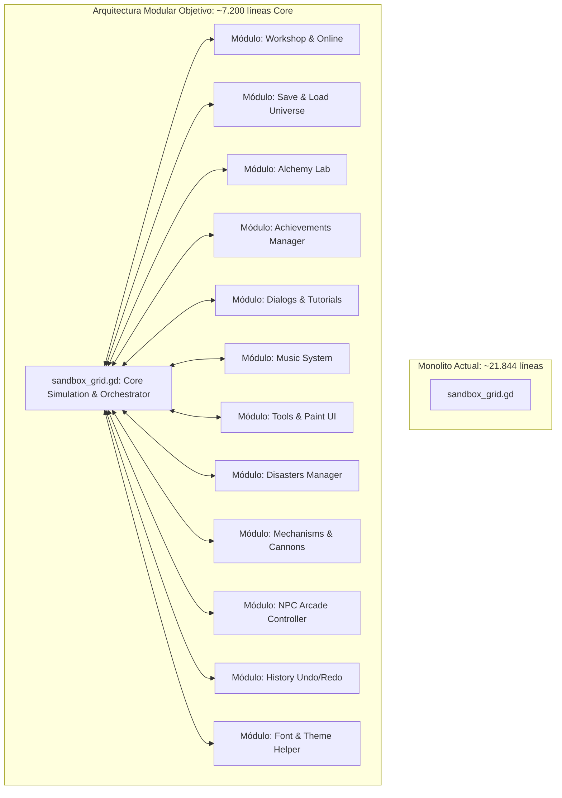

# Plan Maestro de Modularización Arquitectónica: `sandbox_grid.gd`
> **Objetivo del Documento**: Definir la estrategia técnica, catálogo de módulos, rangos de código de origen, consideraciones de dependencias y la hoja de ruta incremental para desacoplar el archivo monolítico `sandbox_grid.gd` (actualmente de **21.844 líneas**) en **12 submódulos especializados**, reduciendo el controlador central a un rango óptimo de **~6.500 a 7.500 líneas** sin degradar el rendimiento del juego ni comprometer la estabilidad alcanzada.

---

## 1. Diagnóstico Actual y Filosofía de Diseño

### 1.1 El Problema del Monolito
`sandbox_grid.gd` ha centralizado durante el desarrollo intensivo:
1. El bucle de física de partículas de alta velocidad y autómata celular.
2. La orquestación y sincronización de memoria con el motor C++ GDExtension (`SandboxGridNode`).
3. El volcado de texturas RGBA a los fragment shaders (`sandbox_render.gdshader`).
4. Sistemas de interfaz de usuario de gran escala (Taller Workshop, Laboratorio de Alquimia, Menú de Logros, Ajustes de Herramientas, Paint UI, Arcade Joypad).
5. Servicios de persistencia, compresión y serialización de mundos (`.sbu`).
6. Lógicas secundarias de eventos (Desastres, Secuenciador Musical, Cañones y Tuberías, Diálogos y Tutoriales).

Con más de 21.800 líneas, el coste de mantenimiento, legibilidad y riesgo de conflicto es crítico.



### 1.2 Regla de Oro: Módulos Fríos (COLD) vs Bucles Calientes (HOT)
En simuladores de partículas en Godot Engine, las llamadas a métodos entre diferentes objetos de GDScript introducen una penalización por llamada dinámica (`call overhead`).
- **Bucles Calientes (HOT / In-Frame)**: Código que se ejecuta miles o cientos de miles de veces por segundo (ej. `_process_interactions`, `_step_simulation`, `_swap_cells`, `_process_electricity`, propagación de fuego/ácido). **Este código DEBE PERMANECER en `sandbox_grid.gd` y en el motor C++ (`SandboxGridNode`)**.
- **Módulos Fríos (COLD / Event-Driven)**: Código que responde a la interacción del usuario, apertura de menús, guardado de archivos, desbloqueo de metas o eventos episódicos. Su extracción a clases y scripts separados tiene un **impacto de rendimiento de 0.00%** y descongestiona más del 65% del código.

### 1.3 Patrón Arquitectónico de Modularización: Composición y Señales
Para evitar referencias circulares en Godot 4:
1. **Ubicación de submódulos**: Los nuevos scripts se alojarán en una carpeta dedicada:
   `res://sandbox/scripts/sandbox/modules/`
2. **Tipo de módulo**: Heredarán de `Node` (para módulos con UI o timers) o `RefCounted` (para serializadores o procesadores de datos puros).
3. **Inyección de Dependencias**: Durante la inicialización (`_ready` de `sandbox_grid.gd`), el núcleo instancia el módulo y le pasa una referencia de sí mismo mediante un método explícito `setup(grid)`:
   ```gdscript
   var workshop_ui = SandboxWorkshopUI.new()
   add_child(workshop_ui)
   workshop_ui.setup(self)
   ```
4. **Desacoplamiento mediante Señales**:
   - El módulo se comunica con el núcleo emitiendo señales (ej. `signal world_load_requested(data)`, `signal material_custom_created(slot, data)`).
   - El núcleo conecta estas señales a sus rutinas de bajo nivel.

---

## 2. Catálogo Detallado de los 12 Módulos a Extraer

A continuación se detalla cada submódulo propuesto, especificando rangos de líneas actuales, funciones que absorbe, dependencias, perfil de rendimiento y consideraciones técnicas.

---

### Módulo 1: Taller y Comunidad en Línea (`SandboxWorkshopUI`)
* **Archivo de Destino**: `res://sandbox/scripts/sandbox/modules/sandbox_workshop_ui.gd`
* **Perfil de Rendimiento**: **COLD** (100% orientado a eventos de red e interfaz).
* **Rango de Líneas en `sandbox_grid.gd`**:
  - Líneas `83 - 162` (Gestión de economía diaria, descargas gratuitas, contadores y cuotas de subida).
  - Líneas `4121 - 6819` (Construcción del panel UI, paginación, búsqueda por código alfanumérico con dígito verificador, llamadas asíncronas a Firestore/Storage, tarjetas de mundos, diálogos modales de subida y edición, reportes y likes).
* **Líneas Estimadas a Extraer**: **~2.780 líneas**.
* **Funciones Clave que Absorbe**:
  - `_load_workshop_economy()`, `_save_workshop_economy()`, `_get_next_update_unix()`, `_get_last_update_unix()`, `_update_day_check()`.
  - `_setup_workshop_ui()`, `_build_pagination()`, `_fetch_top_async()`, `_get_char_value()`, `_get_value_char()`, `_verify_map_code()`.
  - `_on_search_world_requested()`, `_fetch_recientes_async()`, `_fetch_mis_mundos_async()`, `_update_local_recientes_cache()`, `_fetch_mis_descargas_async()`.
  - `_trigger_lazy_sync()`, `_show_empty_state_message()`, `_on_world_delete_downloaded()`, `_on_world_like_requested()`, `_on_world_unlike_requested()`.
  - `_update_local_download_likes()`, `_on_world_report_requested()`, `_on_world_play_requested()`, `_show_download_ad_popup()`, `_on_world_download_requested()`.
  - `_push_to_action_buffer()`, `_show_upload_slot_selector()`, `_show_world_manager_dialog()`, `_delete_world_from_workshop()`.
  - `_load_workshop_cache()`, `_save_workshop_cache()`, `_on_world_edit_requested()`, `_show_edit_world_dialog()`, `_show_upload_world_dialog()`.
* **Variables que Absorbe**:
  `_cached_top_semanal_doc`, `_cached_recientes_doc`, `top_countdown_label`, `bot_countdown_label`, `top_downloads_count_label`, `free_downloads_remaining`, `pending_ad_upload`, `uploads_today`, `last_upload_day`, `liked_worlds`, `reported_worlds`.
* **Dependencias y Cuidados**:
  - Requiere conexión con el singleton autoload `WorkshopManager` y `AdMobManager`.
  - Cuando el usuario descarga y juega un mapa (`_on_world_play_requested`), no debe cargar los bytes directamente: emitirá una señal `request_load_world(world_data)` hacia `sandbox_grid.gd`.
  - Para subir un mapa (`_show_upload_world_dialog`), solicitará al núcleo la serialización del slot activo mediante `grid.get_slot_data(slot_id)`.

---

### Módulo 2: Sistema de Guardado y Serialización (`SandboxSaveSystem`)
* **Archivo de Destino**: `res://sandbox/scripts/sandbox/modules/sandbox_save_system.gd`
* **Perfil de Rendimiento**: **COLD** (I/O de archivos local, compresión y permisos).
* **Rango de Líneas en `sandbox_grid.gd`**:
  - Líneas `7666 - 7814` (Caché de rotación de pantalla / serialización rápida de memoria).
  - Líneas `17674 - 19021` (Panel de guardado en ranuras, serialización del formato `.sbu`, compresión zlib/gzip, modales de confirmación, importación/exportación con explorador nativo y permisos de almacenamiento en Android).
* **Líneas Estimadas a Extraer**: **~1.500 líneas**.
* **Funciones Clave que Absorbe**:
  - `_setup_save_ui()`, `_add_save_slot_ui()`, `_get_slot_data()`, `_confirm_save()`, `_confirm_load()`.
  - `_sanitize_filename()`, `_is_version_newer()`, `_show_confirm_dialog()`, `_show_modal_message()`.
  - `_check_and_request_storage_permission()`, `_show_processing_overlay()`, `_execute_monetized_action()`.
  - `_on_share_pressed()`, `_on_import_pressed()`, `_import_sbu_file()`, `_execute_import_data()`.
  - `_save_to_slot()`, `_load_from_slot()`, `_load_world_from_path()`.
  - `_get_cleaned_lab_data()`, `_restore_lab_data()`.
  - `_save_rotation_cache()`, `_load_rotation_cache()`.
* **Variables que Absorbe**:
  Slots de guardado en `user://`, metadatos de versiones, buffers temporales de rotación.
* **Dependencias y Cuidados**:
  - **Interacción con C++**: Para la serialización ultra-rápida, hace uso de `map_grid_data` en `SandboxGridNode`. El módulo invocará `grid.map_grid_data(...)`.
  - **Reconstitución de entidades**: Al cargar un archivo `.sbu`, debe restaurar `cells`, `tags_array`, `cell_paint_colors`, pero también las entidades complejas (`active_npcs`, compuertas lógicas, pistones, cañones, tuberías). El módulo puede encapsular el parser del archivo y entregar al grid un diccionario estructurado `WorldState` para que cada subsistema restaure sus arrays.

---

### Módulo 3: Laboratorio de Alquimia y Materiales Custom (`SandboxLabUI`)
* **Archivo de Destino**: `res://sandbox/scripts/sandbox/modules/sandbox_lab.gd`
* **Perfil de Rendimiento**: **COLD** (UI de personalización y sincronización de shaders bajo demanda).
* **Rango de Líneas en `sandbox_grid.gd`**:
  - Líneas `6820 - 7420` (Construcción de la interfaz de laboratorio: sliders RGB/HSV, selectores de estado líquido/gas/polvo/sólido, gravedad y etiquetas reactivas).
  - Líneas `7511 - 7638` (Persistencia del estado de laboratorio en slots 900, 901 y 902, tutorial guiado del laboratorio).
  - Líneas `7815 - 8181` (Desbloqueo temporal con AdMob, actualización de la paleta del shader `palette_tex`, aplicación al registro de materiales del motor, visor previo).
* **Líneas Estimadas a Extraer**: **~1.400 líneas**.
* **Funciones Clave que Absorbe**:
  - `_setup_lab_ui()`, `_save_lab_state()`, `_load_lab_state()`, `_set_lab_unlocked()`.
  - `_update_custom_mats_in_material_grid()`, `_sync_palette_to_shader()`, `_apply_custom_material_to_engine()`.
  - `_update_lab_inspector()`, `_update_lab_preview()`, `_update_lab_tutorial_highlight()`.
* **Variables que Absorbe**:
  `lab_custom_data`, `lab_unlock_expiry_unix`, referencias a sliders y nodos de UI del panel de alquimia.
* **Dependencias y Cuidados**:
  - El laboratorio escribe en `mat_colors_1`, `mat_colors_2`, `mat_colors_3` y `material_tags_raw` en los índices 900..902.
  - El método `_sync_palette_to_shader` interactúa con `palette_tex` (la textura de 2048x3 que alimenta a `sandbox_render.gdshader`). Debe asegurarse que el grid exponga `grid.update_shader_palette_row(...)` o pase la referencia de la textura.
  - Requiere chequear `AdMobManager` para los anuncios bonificados que otorgan acceso temporal.

---

### Módulo 4: Sistema y Menú de Logros (`SandboxAchievementManager`)
* **Archivo de Destino**: `res://sandbox/scripts/sandbox/modules/sandbox_achievements.gd`
* **Perfil de Rendimiento**: **COLD / WARM Liviano** (Polling distribuido cada 2 segundos y visualización UI).
* **Rango de Líneas en `sandbox_grid.gd`**:
  - Líneas `2505 - 2725` (Constantes `GOOGLE_PLAY_ACHIEVEMENTS`, `ACHIEVEMENT_ICONS`, diccionario maestro de 22 logros).
  - Líneas `2726 - 3019` (Guardado/carga en `user://achievements.cfg`, máquina de polling distribuido en 13 pasos, integración con Google Play Games y Firebase Analytics).
  - Líneas `19022 - 19584` (Secuencia cinemática de revelación del botón dorado 🏆, toast animado con clips y shaders, menú modal con visualizador y detalle).
* **Líneas Estimadas a Extraer**: **~1.080 líneas**.
* **Funciones Clave que Absorbe**:
  - `_save_global_achievements()`, `_has_unseen_achievements()`, `_load_global_achievements()`.
  - `_check_achievement_conditions()`, `_check_achievement_step()`, `_unlock_achievement()`, `_record_tornado_discovery()`.
  - `_trigger_achievement_reveal()`, `_show_achievement_notification()`, `_setup_achievement_menu()`, `_on_achievement_item_clicked()`.
* **Variables que Absorbe**:
  `achievements`, `is_achievement_menu_unlocked`, `achievement_check_timer`, `achievement_sequence_step`, `achievement_pulse_tween`.
* **Dependencias y Cuidados**:
  - `_check_achievement_step` lee estados del mundo (por ejemplo, conteo de NPCs activos en equipos, si hay agua electrificada, o si hay un tsunami con 4 líquidos).
  - **Optimización**: En lugar de leer directamente los arrays masivos de celdas desde el módulo, el grid puede proporcionarle métodos de consulta o el módulo puede recibir un contexto `GridMetricsSnapshot`.
  - Conexión con `GodotPlayGameServices` y `AnalyticsManager`.

---

### Módulo 5: Gestor de Diálogos, Popups y Tutoriales (`SandboxDialogManager`)
* **Archivo de Destino**: `res://sandbox/scripts/sandbox/modules/sandbox_dialogs.gd`
* **Perfil de Rendimiento**: **COLD** (100% centrado en animaciones de UI, notificaciones modales y primeros pasos del usuario).
* **Rango de Líneas en `sandbox_grid.gd`**:
  - Líneas `276 - 392` (Burbuja explicativa de zoom y navegación).
  - Líneas `1831 - 2433` (Popup de bienvenida multilingüe, diálogo de calificación con estrellas para Google Play, tutorial interactivo guiado por pasos, efectos de pulso visual en botones).
  - Líneas `16620 - 16784` (Burbujas tutoriales de compuertas lógicas, celdas de cuadrícula, bloques de fase, cañones y pistones).
  - Líneas `19585 - 19966` (Popup especial de agradecimiento con shader multicolor rotativo, visor de imágenes a pantalla completa).
  - Líneas `21773 - 21840` (Burbujas flotantes centradas).
* **Líneas Estimadas a Extraer**: **~1.350 líneas**.
* **Funciones Clave que Absorbe**:
  - `_show_welcome_message()`, `_show_rating_popup()`, `_start_interactive_tutorial()`, `_show_main_tutorial_step()`.
  - `_start_pulse()`, `_stop_pulse()`, `_show_menu_reminder()`, `_show_zoom_tutorial_bubble()`.
  - `_check_logic_gate_tutorial()`, `_show_logic_gate_tutorial_bubble()`, `_show_grid_tutorial_bubble()`, `_show_unified_tutorial_bubble()`.
  - `_check_phase_block_tutorial()`, `_show_phase_block_tutorial_bubble()`, `_show_cannon_tutorial_bubble()`, `_show_piston_tutorial_bubble()`.
  - `_show_thank_you_popup()`, `_show_fullscreen_image()`, `_show_centered_bubble()`.
* **Variables que Absorbe**:
  Estados de pasos tutoriales, timers de calificación, tweens activos de atención.
* **Dependencias y Cuidados**:
  - Debe tener acceso a `ui_root` para instanciar capas superiores (`CanvasLayer`) y posicionar burbujas sobre los botones del HUD.
  - Guarda si el usuario ya vio el tutorial en `user://settings.cfg`.

---

### Módulo 6: Sistema Musical y Secuenciador (`SandboxMusicSystem`)
* **Archivo de Destino**: `res://sandbox/scripts/sandbox/modules/sandbox_music.gd`
* **Perfil de Rendimiento**: **COLD (UI y registro) / WARM (Reproducción de tonos)**.
* **Rango de Líneas en `sandbox_grid.gd`**:
  - Líneas `596 - 668` (Tablas de afinación, frecuencias de 5 familias de instrumentos, constantes de metrónomo).
  - Líneas `9368 - 9480` (Detección de pulsación corta sobre notas musicales y popup de visualización de tono).
  - Líneas `15446 - 15523` (Registro de materiales con tag `MUSIC`, colocación de bloques musicales).
  - Líneas `16841 - 17673` (Cálculo de semitonos, reproducción de notas con modulación de pitch en `AudioStreamPlayer`, reacción coreográfica de baile en NPCs, interfaz completa de teclado/secuenciador).
* **Líneas Estimadas a Extraer**: **~1.200 líneas**.
* **Funciones Clave que Absorbe**:
  - `_register_musical_materials()`, `_place_music_block()`, `_get_music_data()`, `_encode_music_id()`.
  - `_is_music_mat()`, `_play_music_note()`, `_trigger_npc_dance()`, `_setup_music_ui()`.
  - `_close_music_menu()`, `_setup_music_button()`, `_is_music_active()`.
* **Variables que Absorbe**:
  `MUSIC_INSTRUMENTS`, `INSTRUMENT_NAMES`, pools de reproductores de audio de notas, estado de notas sonando.
* **Dependencias y Cuidados**:
  - Cuando la simulación eléctrica activa una celda musical (`is_music_mat`), el bucle de electricidad en el grid invoca `music_system.play_note(material_id, charge)`.
  - Cuando se tocan notas consecutivas, busca en el array `active_npcs` para activar su bandera de baile (`dance_timer = 3.0`).

---

### Módulo 7: Panel de Herramientas y Paleta de Pintura (`SandboxToolsPaintUI`)
* **Archivo de Destino**: `res://sandbox/scripts/sandbox/modules/sandbox_tools_ui.gd`
* **Perfil de Rendimiento**: **COLD** (Ajustes de usuario y panel flotante de dibujo).
* **Rango de Líneas en `sandbox_grid.gd`**:
  - Líneas `1227 - 1274` (Serialización y carga de opciones de herramientas: volumen, tamaño de pincel, idioma).
  - Líneas `3380 - 4120` (Construcción de la interfaz de `Tools`: barra deslizadora de pincel con previsualización, ajuste de volumen del bus de audio, selectores de bandera/idioma, lógica de pausa con cuenta atrás de seguridad 3-2-1).
  - Líneas `11320 - 11636` (Construcción del panel de `Paint`: selector de colores HSV/RGB, histórico de colores recientes, alternador de modo Fondo vs Elementos).
* **Líneas Estimadas a Extraer**: **~1.100 líneas**.
* **Funciones Clave que Absorbe**:
  - `_save_tool_settings()`, `_load_tool_settings()`, `_setup_tools_ui()`, `_update_game_volume()`.
  - `_setup_paint_ui()`, `_add_recent_paint_color()`, `_update_paint_recent_ui()`, `_update_paint_slider_grabber()`.
* **Variables que Absorbe**:
  `brush_radius`, `recent_paint_colors`, `selected_paint_color`, `is_paint_background_mode`, referencias de UI de herramientas.
* **Dependencias y Cuidados**:
  - Modifica directamente propiedades del grid cuando el usuario interactúa (ej. `grid.brush_radius = new_size`).
  - Llama a `TranslationServer.set_locale(...)` al cambiar de idioma.

---

### Módulo 8: Gestor de Desastres Mundiales y Clima (`SandboxDisasterManager`)
* **Archivo de Destino**: `res://sandbox/scripts/sandbox/modules/sandbox_disasters.gd`
* **Perfil de Rendimiento**: **COLD (UI) / WARM (Simulación de eventos a 60 FPS)**.
* **Rango de Líneas en `sandbox_grid.gd`**:
  - Líneas `807 - 860` (Constantes del volcán y sismología).
  - Líneas `8182 - 8378` (Panel de UI de desastres: botones de activación de Volcán, Terremoto, Tsunami, Tornado, Bombardero y Clima).
  - Líneas `9800 - 10327` (Rutinas de simulación paso a paso: `_process_tsunami`, `_process_bombardero`, `_process_tornado`, `_process_earthquake`, `_process_weather`, `_strike_lightning`).
  - Líneas `15267 - 15290` (`_reset_all_disasters`).
* **Líneas Estimadas a Extraer**: **~850 líneas**.
* **Funciones Clave que Absorbe**:
  - `_setup_disaster_ui()`, `_reset_all_disasters()`.
  - `_process_tsunami()`, `_start_bombardero()`, `_stop_bombardero()`, `_spawn_bomber_bomb()`, `_process_bombardero()`.
  - `_process_tornado()`, `_process_earthquake()`, `_process_weather()`, `_strike_lightning()`, `_strike_lightning_at()`.
* **Variables que Absorbe**:
  `tsunami_intensity`, `bombardero_intensity`, `tornado_active`, `is_volcano_active`, `earthquake_intensity`, `acid_rain_intensity`, temporizadores y posiciones cinemáticas de desastres.
* **Dependencias y Cuidados**:
  - Modifica celdas físicas: debe llamar a `grid.set_cell(x, y, id)` o `grid.explode(x, y, radius)`.
  - Controla el nodo del shader de distorsión visual del tornado (`tornado_visual_node`).

---

### Módulo 9: Mecanismos, Cañones y Tuberías (`SandboxMechanismsManager`)
* **Archivo de Destino**: `res://sandbox/scripts/sandbox/modules/sandbox_mechanisms.gd`
* **Perfil de Rendimiento**: **COLD (UI de ajuste) / WARM (Transporte y disparo por eventos)**.
* **Rango de Líneas en `sandbox_grid.gd`**:
  - Líneas `16159 - 16388` (Cálculo de orientaciones cardinales, colocación de cañones, tuberías simples y tuberías dobles X2).
  - Líneas `19967 - 21629` (Comprobación de energización de cañones, búsqueda de conexiones tubo-cañón, simulación de transporte paso a paso de celdas y absorción/eyección de NPCs en extremos de tuberías, actualización de visuales de tuberías, inspector de configuración de potencia y ángulo del cañón, selector de color para LEDs).
* **Líneas Estimadas a Extraer**: **~1.850 líneas**.
* **Funciones Clave que Absorbe**:
  - `_place_cannon()`, `_place_pipe()`, `_place_pipe_x2()`, `_is_cannon_powered()`, `_is_pipe_connected_on_inlet()`.
  - `_find_connected_pipe_and_endpoint()`, `_find_connected_cannon()`, `_is_cannon_base_material()`, `_get_next_cannon_shoot_material()`.
  - `_fire_cannon()`, `_simulate_cannons()`, `_update_pipe_visuals()`, `_update_pipe_x2_visuals()`.
  - `_find_npc_at_pipe_endpoint()`, `_try_absorb_npc_at_endpoint()`, `_eject_npc_from_pipe()`, `_simulate_pipes()`.
  - `_open_cannon_settings_panel()`, `_open_led_color_panel()`.
* **Variables que Absorbe**:
  `active_cannons`, `active_pipes`, `active_pipes_x2`, referencias a paneles de configuración de cañón y LED.
* **Dependencias y Cuidados**:
  - Absorbe y eyecta tanto píxeles de material como NPCs. Requiere interactuar con `grid.active_npcs` y la cuadrícula física.
  - La simulación de cañones y tuberías se ejecutará mediante un método `step(delta)` invocado desde el bucle principal solo cuando existan mecanismos activos en la escena.

---

### Módulo 10: Control Manual y Modo Arcade (`SandboxNpcControlManager`)
* **Archivo de Destino**: `res://sandbox/scripts/sandbox/modules/sandbox_npc_control.gd`
* **Perfil de Rendimiento**: **COLD (UI) / WARM (Gestión de eventos de entrada táctil)**.
* **Rango de Líneas en `sandbox_grid.gd`**:
  - Líneas `11637 - 12150` (Panel lateral de selección de NPCs, instanciación del Gamepad táctil en pantalla con joystick virtual circular, botón de salto, botón de acción dinámico contextual por clase, input handling del pad virtual, ejecución de acciones de soldado poseído, desposeer `_stop_controlling_npc`).
  - Líneas `15291 - 15447` (Callbacks de selección arcade, actualización dinámica de iconos del botón según rol: minero pica, arquero apunta flecha, mago dispara fuego).
* **Líneas Estimadas a Extraer**: **~800 líneas**.
* **Funciones Clave que Absorbe**:
  - `_setup_npc_panel_node()`, `_setup_npc_control_gui()`, `_stop_controlling_npc()`, `_toggle_npc_mode_menu()`.
  - `_handle_controlled_npc_input()`, `_trigger_controlled_npc_action()`.
  - `_on_arcade_selection_made()`, `_update_arcade_dynamic_button()`.
* **Variables que Absorbe**:
  `controlled_npc`, `npc_control_gui`, `is_npc_mode_menu_open`, buffers de entrada del joystick virtual.
* **Dependencias y Cuidados**:
  - Solo procesa eventos cuando `controlled_npc != null`.
  - Al ejecutar una acción (cavar, disparar), invoca rutinas que están en el subsistema de NPCs del grid (`grid._miner_dig`, `grid._shoot_arrow`, etc.).

---

### Módulo 11: Gestor de Historial Deshacer/Rehacer (`SandboxHistoryManager`)
* **Archivo de Destino**: `res://sandbox/scripts/sandbox/modules/sandbox_history.gd`
* **Perfil de Rendimiento**: **COLD** (100% accionado tras soltar el trazo o pulsar Undo/Redo).
* **Rango de Líneas en `sandbox_grid.gd`**:
  - Líneas `9540 - 9726` (Clonado profundo de NPCs `_deep_copy_npcs`, compuertas y pistones, guardado del estado en pila circular, restauración de arrays de celdas y actualización de los botones ↩️ y ↪️).
* **Líneas Estimadas a Extraer**: **~200 líneas**.
* **Funciones Clave que Absorbe**:
  - `_deep_copy_npcs()`, `_deep_copy_logic_gates()`, `_deep_copy_pistons()`.
  - `save_history_state()`, `_restore_npcs_from_snapshot()`, `_restore_logic_gates_from_snapshot()`.
  - `undo_history()`, `redo_history()`, `_update_undo_redo_ui()`.
* **Variables que Absorbe**:
  Pila de snapshots (`history_stack`, `history_index`, `max_history_depth`).
* **Dependencias y Cuidados**:
  - Por su tamaño compacto y total aislamiento de la física frame-a-frame, **es el candidato perfecto para ser el primer módulo piloto**.

---

### Módulo 12: Utilidades de Tipografía y Fuente Segura (`SandboxFontHelper`)
* **Archivo de Destino**: `res://sandbox/scripts/sandbox/modules/sandbox_font_helper.gd`
* **Perfil de Rendimiento**: **COLD** (Carga estática y cacheo de fuentes del sistema).
* **Rango de Líneas en `sandbox_grid.gd`**:
  - Líneas `680 - 1188` (Lógica de selección de fuentes con fallbacks internacionales para caracteres chinos, japoneses, cirílicos, árabes y símbolos, evitando bloqueos o caracteres rotos `tofu` en dispositivos móviles).
* **Líneas Estimadas a Extraer**: **~510 líneas**.
* **Funciones Clave que Absorbe**:
  - `_get_safe_font()`.
* **Variables que Absorbe**:
  Caché interna de la fuente resuelta (`_cached_safe_font`).
* **Dependencias y Cuidados**:
  - Se puede implementar como una clase con método estático: `SandboxFontHelper.get_safe_font()`.
  - Puede ser consumido inmediatamente por todos los demás módulos UI sin necesidad de inyectar dependencias.

---

## 3. Matriz Comparativa y Métricas de Impacto

| Módulo | Archivo Propuesto | Líneas Aprox. | Perfil | Prioridad / Fase |
| :--- | :--- | :---: | :---: | :---: |
| **1. Taller & Workshop** | `modules/sandbox_workshop_ui.gd` | 2.780 | COLD | Fase 2 |
| **2. Guardado & Serialización** | `modules/sandbox_save_system.gd` | 1.500 | COLD | Fase 2 |
| **3. Laboratorio Alquimia** | `modules/sandbox_lab.gd` | 1.400 | COLD | Fase 3 |
| **4. Sistema de Logros** | `modules/sandbox_achievements.gd` | 1.080 | COLD / WARM | Fase 1 |
| **5. Diálogos & Tutoriales** | `modules/sandbox_dialogs.gd` | 1.350 | COLD | Fase 2 |
| **6. Sistema Musical** | `modules/sandbox_music.gd` | 1.200 | COLD / WARM | Fase 3 |
| **7. Herramientas & Paint UI** | `modules/sandbox_tools_ui.gd` | 1.100 | COLD | Fase 3 |
| **8. Desastres & Clima** | `modules/sandbox_disasters.gd` | 850 | COLD / WARM | Fase 4 |
| **9. Cañones, Tubos & Mecanismos** | `modules/sandbox_mechanisms.gd` | 1.850 | COLD / WARM | Fase 4 |
| **10. Control Manual Arcade** | `modules/sandbox_npc_control.gd` | 800 | COLD / WARM | Fase 4 |
| **11. Historial (Undo / Redo)** | `modules/sandbox_history.gd` | 200 | COLD | Fase 1 (Piloto) |
| **12. Fuente Segura & Theme** | `modules/sandbox_font_helper.gd` | 510 | COLD | Fase 1 (Inmediato) |
| **TOTAL A EXTRAER** | **12 Archivos de Módulo** | **~14.620** | - | - |
| **REMANENTE CORE** | `sandbox_grid.gd` | **~7.224** | **HOT** | **Bucle Principal** |

> [!NOTE]
> La extracción de estas ~14.600 líneas cumple exactamente el objetivo de situar a `sandbox_grid.gd` en una franja saludable de entre 3.000 y 8.000 líneas totales, dejando intacta toda la optimización crítica.

---

## 4. Qué Permanece en el Core (`sandbox_grid.gd`) y Motor C++

Los siguientes componentes **NO deben moverse a módulos externos en GDScript**, ya que conforman el núcleo de alta velocidad:

1. **Estructuras de Memoria Primarias**:
   - `cells: PackedInt32Array` (Matriz del mundo).
   - `tags_array: PackedInt64Array` (Máscara de bits de comportamiento físico).
   - `color_buffer: PackedByteArray` (Volcado de texturas de render).
   - `charge_array: PackedInt32Array` (Red eléctrica).
2. **Bucles de Simulación Física por Cuadro (HOT)**:
   - `_step_simulation()`: Coordinador de pasos temporales y multithreading con Chunks.
   - `_process_interactions()`: Reacciones químicas directas píxel a píxel.
   - `_move_particle()` y `_swap_cells()`: Transporte cinético elemental.
   - `_process_electricity()`: Algoritmo BFS de propagación eléctrica.
   - `_explode()`: Ondas de choque térmicas y cinéticas con límite de presupuesto por frame.
3. **Simulación de Inteligencia Artificial de NPCs**:
   - `_process_npcs(delta)`: Percepción sensorial, visión, máquina de estados emocional, combate cuerpo a cuerpo y a distancia.
   - `_process_projectiles()`: Balística de flechas y bolas de fuego.
4. **Coordinación de Renderizado GPU**:
   - `_update_texture()`: Transferencia de regiones sucias a las texturas de shaders.
   - `_draw()`: Renderizado de emojis, capas vectoriales y líneas de interacción.

---

## 5. Hoja de Ruta de Ejecución Incremental (Paso a Paso)

Para garantizar cero regresiones y permitir validar el juego en cada hito, la modularización se realizará de manera estrictamente **secuencial (módulo por módulo)**, siguiendo una progresión calculada desde el componente más aislado e inocuo hasta los sistemas con mayor interactividad.

```mermaid
graph TD
    subgraph Fase 1: Módulos Base & Pilotos
        P1[Paso 1: Módulo 12 - Font & Theme Helper] --> P2[Paso 2: Módulo 11 - History Undo/Redo]
        P2 --> P3[Paso 3: Módulo 4 - Achievements Manager]
    end

    subgraph Fase 2: Servicios & UI Desacoplada
        P3 --> P4[Paso 4: Módulo 5 - Dialogs & Tutorials]
        P4 --> P5[Paso 5: Módulo 7 - Tools & Paint UI]
        P5 --> P6[Paso 6: Módulo 2 - Save & Load System]
        P6 --> P7[Paso 7: Módulo 1 - Workshop & Online]
    end

    subgraph Fase 3: Sistemas Creativos
        P7 --> P8[Paso 8: Módulo 3 - Alchemy Lab]
        P8 --> P9[Paso 9: Módulo 6 - Music System]
    end

    subgraph Fase 4: Mecanismos, Entrada & Desastres
        P9 --> P10[Paso 10: Módulo 10 - NPC Arcade Control]
        P10 --> P11[Paso 11: Módulo 8 - Disasters Manager]
        P11 --> P12[Paso 12: Módulo 9 - Mechanisms & Cannons]
    end
```

---

## 6. Hoja de Ruta Detallada Módulo por Módulo y Batería de Pruebas

Para cada módulo se especifica:
- **Por qué ocupa esa posición en el orden** (prerrequisitos y minimización de riesgo).
- **Protocolo de pruebas manuales y funcionales** que el desarrollador debe realizar en Godot antes de dar por cerrada la extracción y avanzar al siguiente paso.

---

### Paso 1: `SandboxFontHelper` (`modules/sandbox_font_helper.gd`)
* **Líneas a Extraer de `sandbox_grid.gd`**: ~510 líneas (L. 680 a 1188).
* **Por qué es el primero**: Cero dependencias hacia otros sistemas. Es una clase estática de utilidad tipográfica (`SandboxFontHelper.get_safe_font()`). Todos los paneles de interfaz de los siguientes módulos la consumen, por lo que debe estar aislada y disponible desde el inicio.
* **Batería de Pruebas para el Desarrollador**:
  1. **Compilación Limpia**: Iniciar la escena principal (`main_scene.tscn`) y corroborar en la consola de Godot que no existan errores ni warnings del tipo `Method _get_safe_font not found` o `Invalid Font Resource`.
  2. **Renderizado de Textos y Títulos**: Abrir visualmente los paneles HUD existentes (Herramientas, NPCs, Desastres) y verificar que los títulos, etiquetas y números se muestran con la tipografía correcta, sin caracteres rotos o cuadrados negros ("tofu").
  3. **Prueba de Caracteres Internacionales**: Cambiar el idioma del juego entre Español, Inglés, Francés, Alemán y Portugués; verificar que los acentos, diéresis y caracteres especiales renderizan con nitidez en pantalla.

---

### Paso 2: `SandboxHistoryManager` (`modules/sandbox_history.gd`)
* **Líneas a Extraer de `sandbox_grid.gd`**: ~200 líneas (L. 9540 a 9726).
* **Por qué es el segundo**: Es el módulo piloto ideal para validar la inyección de dependencias (`setup(self)`) y la manipulación de arrays de bajo nivel (`cells`, `cell_paint_colors`, `active_npcs`) en una escala muy reducida (~200 líneas), con riesgo de regresión prácticamente nulo.
* **Batería de Pruebas para el Desarrollador**:
  1. **Test de Deshacer Básico (Undo)**: Dibujar un trazo de piedra o arena en el centro de la cuadrícula. Soltar el dedo/clic. Pulsar el botón `↩️` (Deshacer).
     * *Resultado esperado*: El trazo de material debe desaparecer de inmediato y el lienzo volver a su estado previo.
  2. **Test de Rehacer Básico (Redo)**: Pulsar el botón `↪️` (Rehacer).
     * *Resultado esperado*: El trazo debe reaparecer exactamente con el mismo material y posición.
  3. **Test con Entidades Vivas (NPCs)**: Colocar un soldado o arquero en el mundo, esperar a que camine unos píxeles, luego pintar una barrera de tierra. Pulsar Deshacer.
     * *Resultado esperado*: La barrera de tierra se borra, pero el NPC no crashea, no se duplica, ni se congela su máquina de estados.
  4. **Test de Límite de Pila (Stack Overflow Guard)**: Pintar más de 12 trazos continuos y deshacerlos todos sucesivamente.
     * *Resultado esperado*: La pila no debe desbordarse (`IndexOutOfBoundsException`) y los botones de Undo/Redo deben deshabilitarse visualmente cuando no haya más estados en el historial.

---

### Paso 3: `SandboxAchievementManager` (`modules/sandbox_achievements.gd`)
* **Líneas a Extraer de `sandbox_grid.gd`**: ~1.080 líneas (L. 2505 a 3019 y L. 19022 a 19584).
* **Por qué es el tercero**: Desacopla por completo la persistencia en `user://achievements.cfg`, la sincronización con Google Play Games y la animación del botón de trofeo 🏆. Su lógica de polling corre a intervalos lentos (cada 2s), garantizando independencia total del núcleo de físicas.
* **Batería de Pruebas para el Desarrollador**:
  1. **Persistencia de Logros Existentes**: Abrir el juego con un perfil que ya tenga logros desbloqueados. Verificar que el archivo `user://achievements.cfg` se lee correctamente y los logros desbloqueados permanecen guardados.
  2. **Apertura del Menú de Trofeos**: Pulsar el botón de logro 🏆 en la barra de acciones.
     * *Resultado esperado*: El panel de logros se despliega con su scroll suave, mostrando las 22 tarjetas con sus iconos de `assets/icon_ach/`, títulos y descripciones traducidas.
  3. **Test de Desbloqueo en Caliente**:
     * *Prueba 1 (Electrificante)*: Colocar agua y tocarla con un cable energizado. Debe desbloquear el logro `electrifying`.
     * *Prueba 2 (BOOM)*: Colocar una fila de 20 bloques de TNT y detonarlos en cadena. Debe desbloquear el logro `boom`.
  4. **Notificación Cinemática (Toast) y Audio**: Comprobar que al desbloquearse un logro, salta la animación deslizante del cartel toast con el borde dorado y se reproduce el audio SFX (`achievement_menu_unlock`) sin tirones ni micro-congelamientos de fotogramas.

---

### Paso 4: `SandboxDialogManager` (`modules/sandbox_dialogs.gd`)
* **Líneas a Extraer de `sandbox_grid.gd`**: ~1.350 líneas (L. 276-392, L. 1831-2433, L. 16620-16784, L. 19585-19966, L. 21773-21840).
* **Por qué es el cuarto**: Centraliza todas las capas modales superiores (`CanvasLayer`), popups de bienvenida, calificación en tiendas, burbujas de onboarding y agradecimiento con shaders. Prepara el entorno para que los paneles de herramientas y guardado muestren alertas limpiamente.
* **Batería de Pruebas para el Desarrollador**:
  1. **Tutorial de Primer Arranque**: Iniciar con una configuración limpia (o forzar `_start_interactive_tutorial()`).
     * *Resultado esperado*: Se despliega la burbuja de bienvenida, la animación de pulso resalta el botón objetivo del HUD y el tutorial avanza fluidamente al interactuar con él.
  2. **Burbujas Contextuales de Mecanismos**: Seleccionar de la barra de materiales una compuerta lógica (AND/OR), un pistón o un cañón.
     * *Resultado esperado*: Se despliega la burbuja explicativa contextual (`_show_unified_tutorial_bubble`) indicando cómo orientar y conectar el bloque, cerrándose al hacer clic fuera de ella.
  3. **Popup Especial con Shader Neón**: Forzar la apertura de `_show_thank_you_popup()`.
     * *Resultado esperado*: La ventana modal aparece con su fondo semitransparente bloqueando clics al juego, y el shader de borde neón multicolor rota de forma suave sin sobrecargar la GPU móvil.

---

### Paso 5: `SandboxToolsPaintUI` (`modules/sandbox_tools_ui.gd`)
* **Líneas a Extraer de `sandbox_grid.gd`**: ~1.100 líneas (L. 1227-1274, L. 3380-4120, L. 11320-11636).
* **Por qué es el quinto**: Agrupa la configuración esencial de la partida (pausa, volumen, radio de pincel, idiomas) y el panel de pintura cromática (fondo y elementos). Es un módulo puramente COLD que solo actúa cuando el usuario toca los controles.
* **Batería de Pruebas para el Desarrollador**:
  1. **Pestaña de Herramientas (🛠️ Tools)**:
     * *Slider de Pincel*: Mover el tamaño de pincel de 1px a 6px; dibujar un trazo en el mundo y confirmar que el grosor de dibujo cambia en tiempo real.
     * *Control de Audio*: Mover el slider de volumen; verificar que el volumen general de los efectos de sonido se atenúa o amplifica.
     * *Pausa con Countdown*: Pulsar el botón Pausa (la simulación se detiene por completo). Pulsar Reanudar (debe mostrar la cuenta atrás de seguridad 3-2-1 antes de reactivar la física).
     * *Limpiar Pantalla*: Pulsar "Clear" y corroborar que todas las partículas desaparecen.
  2. **Pestaña de Pintura (🎨 Paint)**:
     * *Selector de Color*: Modificar el tono en el selector de color libre HSV/RGB.
     * *Pintar Fondo vs Elementos*: Activar "Pintar Fondo" y pintar sobre el aire (debe teñir `background_tex`). Conmutar a "Pintar Elementos" y pintar sobre un bloque de piedra (debe teñir `element_paint_tex` sin destruir la piedra).
     * *Historial de Recientes*: Comprobar que los últimos colores elegidos se agregan a la fila de accesos directos y pueden volver a seleccionarse con un toque.

---

### Paso 6: `SandboxSaveSystem` (`modules/sandbox_save_system.gd`)
* **Líneas a Extraer de `sandbox_grid.gd`**: ~1.500 líneas (L. 7666-7814 y L. 17674-19021).
* **Por qué es el sexto**: Es el motor de persistencia local del universo (formato comprimido `.sbu`). **Debe estar perfectamente aislado y comprobado antes de extraer el Workshop**, ya que el Workshop utiliza este sistema para cargar y guardar los mapas descargados o listos para subir.
* **Batería de Pruebas para el Desarrollador**:
  1. **Guardado en Ranura Local**: Construir una escena rica con arena, agua fluyendo, lava, 1 compuerta lógica AND, un pistón y 2 NPCs (un minero y un arquero). Abrir el menú 💾 Guardar y almacenar en la "Ranura 1".
  2. **Recarga Fidedigna y Consistencia**: Limpiar el mapa con Clear. Cargar la "Ranura 1".
     * *Verificación visual y física*:
       - ¿Las partículas cayeron exactamente en sus posiciones originales?
       - ¿Las pinturas de fondo y elementos siguen presentes?
       - ¿Los NPCs reaparecen con su vida, equipo y facción correcta?
       - ¿La compuerta lógica y el pistón reaccionan a la electricidad al reanudar?
  3. **Exportación / Importación Nativa**: Exportar la ranura a un archivo `.sbu` en el almacenamiento del dispositivo. Importarlo nuevamente a través del selector de archivos en otra ranura libre y confirmar que los datos no se corrompen durante la descompresión zlib.

---

### Paso 7: `SandboxWorkshopUI` (`modules/sandbox_workshop_ui.gd`)
* **Líneas a Extraer de `sandbox_grid.gd`**: ~2.780 líneas (L. 83-162 y L. 4121-6819).
* **Por qué es el séptimo**: Es el módulo más voluminoso del proyecto. Al haber extraído previamente el sistema de diálogos y el sistema de guardado, el taller puede interactuar limpiamente con ambos sin duplicar lógica ni generar dependencias circulares.
* **Batería de Pruebas para el Desarrollador**:
  1. **Pestañas y Paginación**: Abrir el Taller. Alternar entre las pestañas "Top Semanal", "Recién Subidos", "Mis Mundos" y "Mis Descargas".
     * *Resultado esperado*: Las tarjetas (`WorldCard`) cargan sus miniaturas y datos desde Firebase Firestore sin congelar la interfaz ni solaparse con el HUD.
  2. **Búsqueda por Hash**: Escribir un código alfanumérico conocido en el buscador con dígito verificador (`_verify_map_code`).
     * *Resultado esperado*: Encuentra el mapa exacto o despliega el mensaje de no encontrado sin crashear.
  3. **Likes, Reportes y Persistencia de Economía**: Dar like a un mundo. Salir del taller y volver a entrar.
     * *Resultado esperado*: El estado del like persiste en `user://workshop_economy.cfg` y no permite votar dos veces el mismo mapa.
  4. **Descarga, Recompensa AdMob y Juego Directo**: Descargar un mapa. Si se agotan las 4 descargas gratuitas diarias, verificar que el popup de anuncio bonificado se muestra correctamente. Pulsar "Jugar" sobre un mapa descargado:
     * *Resultado esperado*: La cuadrícula se despeja, carga el mundo descargado mediante `SandboxSaveSystem` y la simulación arranca de inmediato.
  5. **Subida de Mundos**: Abrir el diálogo de subir mundo (`_show_upload_world_dialog`), seleccionar una ranura local, rellenar título y descripción, y comprobar que se genera el paquete de subida a Firebase Storage.

---

### Paso 8: `SandboxLabUI` (`modules/sandbox_lab.gd`)
* **Líneas a Extraer de `sandbox_grid.gd`**: ~1.400 líneas (L. 6820-7420 y L. 7511-8181).
* **Por qué es el octavo**: Permite aislar la manipulación de materiales custom (IDs 900, 901 y 902) y la sincronización con la textura de paleta del shader (`palette_tex`). Es totalmente independiente del flujo general de juego.
* **Batería de Pruebas para el Desarrollador**:
  1. **Creación de Material Custom**: Entrar a la pestaña 🧪 Lab. Seleccionar el "Slot 1" (ID 900).
     * Configurar: Estado = "Líquido", Gravedad = "Normal", Tags = "Inflamable" + "Explosivo Ácido".
     * Colores: Color 1 = Verde Neón, Color 2 = Amarillo, Mezcla = Media.
  2. **Pintado y Comportamiento en Simulación**: Seleccionar el nuevo material en la barra inferior y pintarlo en el mundo.
     * *Resultado esperado*: El líquido fluye horizontalmente como agua, tiene el color verde/amarillo del shader y detona en ácido al acercarle una cerilla de fuego.
  3. **Persistencia tras Reinicio**: Guardar el estado del laboratorio (`_save_lab_state`), cerrar y reabrir el juego.
     * *Resultado esperado*: El slot 900 conserva todos los colores, tags y nombre configurados.
  4. **Monetización (Timer de 12 Horas)**: Verificar que si el acceso temporal está bloqueado, se muestra el botón de recompensa de AdMob y al activarse desbloquea el laboratorio por 12 horas reales guardando la marca unix.

---

### Paso 9: `SandboxMusicSystem` (`modules/sandbox_music.gd`)
* **Líneas a Extraer de `sandbox_grid.gd`**: ~1.200 líneas (L. 596-668, L. 9368-9480, L. 15446-15523, L. 16841-17673).
* **Por qué es el noveno**: Desacopla la lógica de generación de frecuencias musicales, secuenciador rítmico, pentagrama y las reacciones de los personajes.
* **Batería de Pruebas para el Desarrollador**:
  1. **UI del Secuenciador**: Abrir la pestaña 🎹 Música. Seleccionar los distintos instrumentos (Piano Clásico, Grand Piano, Percusión, Synth).
  2. **Colocación y Previsualización de Notas**: Trazar varios bloques musicales en la pantalla. Pulsar brevemente con el dedo sobre un bloque musical:
     * *Resultado esperado*: Se despliega el popup flotante indicando la nota musical (ej. "Do4 / C4") y suena su tono correspondiente.
  3. **Activación Eléctrica por Metrónomo/Cable**: Conectar un metrónomo o cable electrificado a una hilera de bloques musicales afinados.
     * *Resultado esperado*: Al circular la corriente, cada bloque musical emite su nota en tono claro sin saturación ni solapamiento destructivo en los 8 reproductores de audio en pool.
  4. **Coreografía de Danza de NPCs**: Colocar un grupo de 3 o más NPCs cerca de los bloques musicales. Hacer sonar 5 notas en menos de 1 segundo.
     * *Resultado esperado*: Los personajes activan su temporizador de baile (`dance_timer > 0`), mostrando el emoji musical `🎵` o `🎉` y saltando alegremente.

---

### Paso 10: `SandboxNpcControlManager` (`modules/sandbox_npc_control.gd`)
* **Líneas a Extraer de `sandbox_grid.gd`**: ~800 líneas (L. 11637-12150 y L. 15291-15447).
* **Por qué es el décimo**: Separa el mando virtual táctil arcade de la simulación autónoma de los NPCs. Al estar encapsulado, cualquier ajuste ergonómico del pad táctil en pantallas móviles no toca el código de combate general.
* **Batería de Pruebas para el Desarrollador**:
  1. **Posesión Manual de Personaje**: Colocar un Minero y un Guerrero en la cuadrícula. Tocar el botón de posesión arcade (🎮).
     * *Resultado esperado*: El HUD inferior habitual se desliza y oculta, apareciendo en su lugar el joystick circular en la izquierda y los botones de acción/salto a la derecha.
  2. **Control Direccional y Salto**: Mover el joystick táctil en 360 grados.
     * *Resultado esperado*: El personaje camina hacia la izquierda o derecha respondiendo a la inclinación del joystick. Pulsar el botón Salto hace que el personaje supere obstáculos de varios píxeles.
  3. **Acciones Contextuales por Clase**:
     * *Con Minero poseído*: El botón de acción muestra el pico. Al pulsarlo, excava la pared frontal sólida (`_miner_dig`).
     * *Con Guerrero poseído*: El botón de acción muestra la espada. Al pulsarlo, ataca a melé (`_attack_npc`).
     * *Con Arquero poseído*: Al mantener pulsado y orientar, tensa y dispara la flecha balística hacia el objetivo.
  4. **Desposesión y Retorno**: Tocar el botón de salida o soltar el control.
     * *Resultado esperado*: El Gamepad táctil se destruye/oculta limpiamente, el HUD principal regresa y el NPC reanuda su comportamiento de inteligencia artificial autónomo.

---

### Paso 11: `SandboxDisasterManager` (`modules/sandbox_disasters.gd`)
* **Líneas a Extraer de `sandbox_grid.gd`**: ~850 líneas (L. 807-860, L. 8182-8378, L. 9800-10327, L. 15267-15290).
* **Por qué es el undécimo**: Gestiona los desastres a gran escala (Volcán, Tornado, Tsunami, Terremoto, Bombardero, Lluvias ácidas y Rayos). Aunque sus rutinas corren en el frame cuando están activas, modularizarlas permite añadir futuros desastres sin engordar el archivo central.
* **Batería de Pruebas para el Desarrollador**:
  1. **Prueba de Volcán**: Activar el Volcán desde la pestaña 🌋.
     * *Resultado esperado*: Se crea la estructura geológica, brota lava continua y se lanzan proyectiles volcánicos balísticos que dejan rastros de humo.
  2. **Prueba de Tornado y Distorsión de Pantalla**: Activar el Tornado.
     * *Resultado esperado*: El vórtice cinético se desplaza por el escenario; el shader `tornado_visual.gdshader` deforma la cuadrícula visualmente. Si el tornado absorbe fuego o ácido, muta su color y efecto.
  3. **Prueba de Tsunami**: Colocar un lago profundo de agua/ácido y activar Tsunami.
     * *Resultado esperado*: Una ola monumental barre horizontalmente las partículas sólidas y arrastra a los NPCs.
  4. **Prueba de Bombardero Militar**: Activar Bombardero.
     * *Resultado esperado*: Un avión cruza la parte superior soltando bombas en secuencia con cuenta regresiva hasta su impacto explosivo en el suelo.
  5. **Botón Reset Global de Desastres**: Pulsar "Detener Desastres" (`_reset_all_disasters`).
     * *Resultado esperado*: Todas las fuerzas cinéticas activas, proyectiles aéreos y audios continuos en bucle (viento, borboteo de lava) se silencian y limpian de inmediato.

---

### Paso 12: `SandboxMechanismsManager` (`modules/sandbox_mechanisms.gd`)
* **Líneas a Extraer de `sandbox_grid.gd`**: ~1.850 líneas (L. 16159-16388 y L. 19967-21629).
* **Por qué es el duodécimo y final**: Es el subsistema de automatización más avanzado del juego (cañones orientables en 8 ángulos, tuberías neumáticas simples y dobles X2, paneles de configuración de cañones y selectores de color LED). Deja el tramo final de `sandbox_grid.gd` (líneas 19.900 a 21.844) completamente depurado.
* **Batería de Pruebas para el Desarrollador**:
  1. **Tuberías Simples y Dobles (X2)**:
     * Trazar una tubería simple (1 carril) y una tubería X2 (2 carriles).
     * Verter arena o agua en un extremo. Verificar que los píxeles viajan por el trazado de la tubería a velocidad constante y son eyectados por el extremo opuesto sin pérdidas.
  2. **Transporte de Soldados (NPCs) en Tuberías**:
     * Guiar a un soldado hacia el extremo de una tubería doble X2.
     * *Resultado esperado*: El personaje es absorbido en el extremo (`_try_absorb_npc_at_endpoint`), viaja por el trazado y es eyectado en el destino con su vida e identidad íntegras.
  3. **Cañones Neumáticos y Alimentación Automática**:
     * Conectar la salida de una tubería a la recámara trasera de un cañón.
     * Conectar una batería o cable energizado a la base del cañón.
     * *Resultado esperado*: El cañón toma la munición entregada por la tubería y la dispara con fuerza en el ángulo correspondiente a su orientación.
  4. **Panel de Ajuste de Cañones (`CannonSettingsPanel`)**:
     * Tocar un cañón instalado en el mapa.
     * *Resultado esperado*: Se despliega el panel inspector modal de cañones, permitiendo ajustar su ángulo cardinal de disparo y potencia.
  5. **Panel de Color para LEDs Electrónicos**:
     * Tocar un bloque de LED (ID 89).
     * *Resultado esperado*: Se abre el selector de color `_open_led_color_panel`; al seleccionar un nuevo tono, el LED enciende con dicho color al energizarse.

---

## 7. Puertas de Calidad (Quality Gates) y Protocolo de Seguridad

Antes de dar por completado cada paso individual y proceder al siguiente, se debe verificar rigurosamente este checklist:

```
[ ] 1. SINTAXIS Y PARSER: Godot Engine compila el proyecto sin errores ni warnings rojos en la pestaña Output.
[ ] 2. TEST ESPECÍFICO APROBADO: Se superaron todas las pruebas funcionales del módulo descritas en la Sección 6.
[ ] 3. RENDIMIENTO (FPS CHECK): La tasa de fotogramas se mantiene estable a 60 FPS sin micro-tirones ni consumo anómalo de CPU.
[ ] 4. MEMORIA ESTABLE: No se generan instancias huérfanas (Orphan Nodes) al abrir y cerrar los paneles reiteradamente.
[ ] 5. LIMPIEZA DE CÓDIGO VIEJO: Las funciones y variables trasladadas han sido retiradas de `sandbox_grid.gd`, constatando la reducción del contador de líneas del archivo.
[ ] 6. COMMIT DE SEGURIDAD GIT: Se realiza un commit atómico exclusivo para el módulo extraído (ej: `git commit -m "refactor(core): extract SandboxHistoryManager module"`).
```

### Plan de Contingencia y Rollback Rápido
Si durante la extracción de cualquier módulo se produce una inconsistencia difícil de rastrear:
1. Gracias a que cada módulo se extrae en un paso individual y aislado, se puede revertir con un simple `git checkout sandbox_grid.gd` sin perder los avances de los módulos anteriores.
2. Los submódulos creados en `res://sandbox/scripts/sandbox/modules/` no interfieren con el resto del proyecto si no están instanciados en `sandbox_grid.gd`.

